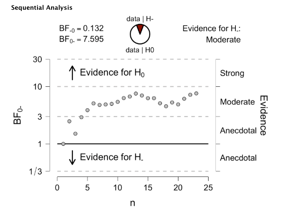

```{r start, include = FALSE}
library(papaja)
```

# Introduction to Bayesian hypothesis testing

Though the basic ideas of hypothesis testing are likely familiar to anyone reading this tutorial, it may be quite instructive to take a step back and talk about what we are really doing at the most basic level, before we begin making any distinctions between frequentist and Bayesian methods. Regardless of the exact form of the hypothesis test being employed, the problem of inference reduces to a simple framework, the flow of which is displayed in Figure \@ref(fig:genModel). First, we fix a *generative* model of nature, by which we mean a statistical model that can make quantitative predictions of nature. For example, we learn in our elementary statistics courses that the normal distribution is a good model for how sample means are distributed if the sample size is large enough. Thus, we can use the normal distribution as a generative model for situations where our data is in the form of a sample mean. 

{width=70%}

For us, however, this flow within this modeling framework is usually inverted. We are confronted with observed data, and our problem is to ascertain the properties of the model which could have conceivably generated these data (see the dashed line of Figure \@ref(fig:genModel)). For example, consider a group of people who are given a treatment to improve their mathematical ability, which we measure using a (fictitious) scale called the Scale for Advancing Mathematical Ability (SAMA). For the general population, SAMA scores are normally distributed with a mean of 50 and a standard deviation of 10. For our participants who have received the treatment, we observe a sample mean of 55. What can we say about the population of people who have received this treatment (that is, the population from which this sample has been drawn)?

To approach this problem using hypothesis testing, we first define two competing generative models. Under one model, denoted $\mathcal{H}_0$, the SAMA scores for the treatment group are the same as in the general population (that is, 50). This model is typically called the *null model* (or *null hypothesis*), and can be written conveniently using symbols as
\[
\mathcal{H}_0:\mu=50,
\]
where $\mu$ represents the mean of the population of people who have had the treatment. For the other model $\mathcal{H}_1$, we want to capture the prediction that SAMA scores will *increase* after treatment. Thus, we define this model as 
\[
\mathcal{H}_1:\mu >50.
\]
Our problem now reduces to one simple question: which model ($\mathcal{H}_0$ or $\mathcal{H}_1$) better predicts our observed data?

From here, we have two paths we can travel. The frequentist path works roughly as follows. First, we assess how well the null hypothesis is able to predict our data. We do this by computing the probability of observing data at least as extreme as our observed sample mean of 55 *if* the null hypothesis is the true model. In symbols, we write this *conditional probability* as $p(\text{data}\mid \mathcal{H}_0)$. In the standard null hypothesis testing framework that we all learned previously, this probability is called the "$p$-value". If this $p$-value is small (i.e., $p<0.05$), we conclude that our data is rare under $\mathcal{H}_0$, and consequently, we reject $\mathcal{H}_0$ as a candidate in our list of possible generative models. Since we only defined two models, rejecting $\mathcal{H}_0$ leaves only $\mathcal{H}_1$ remaining as a candidate.

In this tutorial, we will advocate a fundamentally different approach to this problem and employ Bayesian hypothesis testing. The advantages of Bayesian hypothesis testing have been clearly outlined in a number of previous papers [@wagenmakers2007], but we will point out two here. First, we mentioned that if the $p$-value was small, we could reject $\mathcal{H}_0$, owing to the reasoning that if the null model was good at predicting our observed data, then our data should not have been so rare (we did observe it, after all). However, what would have happened if our $p$-value had been large? It turns out that this would have been completely uninformative, because it is known that under $\mathcal{H}_0$, $p$-values are uniformly distributed (REFERENCE?). So, the $p$-value gives us no indication of whether $\mathcal{H}_0$ is a good model. This leads to a problem of asymmetry; that is, while we can reject $\mathcal{H}_0$, we can never accept $\mathcal{H}_0$.

Another issue is this; recall that in the frequentist procedure described above, the $p$-value measured how well $\mathcal{H}_0$ was able to predict our observed data. However, there was no accompanying measure of the predictive adequacy of $\mathcal{H}_1$. It could be the case that while $\mathcal{H}_0$ was not a good predictive model of our observed data, $\mathcal{H}_1$ might be even worse! We simply do not know. To circumvent this problem, we will use the *Bayes factor* [@kass1995], a ratio which directly indexes the predictive adequacy of $\mathcal{H}_0$ against the predictive adequacy of $\mathcal{H}_1$. Compared to $p$-values, Bayes factors will offer a number of inviting advantages, including the ability to measure support *for* the null hypothesis $\mathcal{H}_0$, as well as the ability to simultaneously measure the ability of both $\mathcal{H}_0$ and $\mathcal{H}_1$ to predict our observed data.

## What is the Bayes factor?

To define the Bayes factor, we must first recall a basic rule of probability known as Bayes' rule:
\begin{equation}\label{eq:bayesRule}
\underbrace{p(\mathcal{M}\mid \text{data})}_{\substack{\text{Posterior beliefs}\\ \text{about model}}} = \underbrace{p(\mathcal{M})}_{\substack{\text{Prior beliefs}\\ \text{about model}}} \times \underbrace{\frac{p(\text{data}\mid \mathcal{M})}{p(\text{data})}}_{\text{predictive updating factor}}.
\end{equation}
This equation tells us that our posterior belief about a model $\mathcal{M}$ (i.e., $p(\mathcal{M}\mid \text{data})$) can be found by taking our *prior* belief about $\mathcal{M}$ and multiplying it by the fraction $p(\text{data}\mid \mathcal{M})/p(\text{data})$. This fraction is a *predictive updating factor* in the sense that it indexes how well our data is predicted by $\mathcal{M}$ compared to how well it is predicted by all other possible models. Now, since the goal here is to directly compare the predictive adequacy of two models, say $\mathcal{H}_0$ and $\mathcal{H}_1$, we can use Equation \ref{eq:bayesRule} to derive the following:
\begin{align*}
  \frac{p(\mathcal{H}_0\mid \text{data})}{p(\mathcal{H}_1\mid \text{data})}
  & = \frac{p(\mathcal{H}_0) \cdot \frac{p(\text{data}\mid \mathcal{H}_0)}{p(\text{data})}}{p(\mathcal{H}_1) \cdot  \frac{p(\text{data}\mid \mathcal{H}_1)}{p(\text{data})}} \\ 
  & = \frac{p(\mathcal{H}_0)\cdot p(\text{data}\mid \mathcal{H}_0)}{p(\mathcal{H}_1)\cdot p(\text{data}\mid \mathcal{H}_1)},\\
\end{align*}
which we can simplify to
\begin{equation}\label{eq:bayesFactor}
\underbrace{\frac{p(\mathcal{H}_0\mid \text{data})}{p(\mathcal{H}_1\mid \text{data})}}_{\substack{\text{posterior beliefs}\\ \text{about models}}} = \underbrace{\frac{p(\mathcal{H}_0)}{p(\mathcal{H}_1)}}_{\substack{\text{prior beliefs}\\ \text{about models}}} \times \underbrace{\frac{p(\text{data}\mid \mathcal{H}_0)}{p(\text{data}\mid \mathcal{H}_1)}}_{\text{predictive updating factor}}.
\end{equation}
The predictive updating factor
\[
BF_{01} = \frac{p(\text{data}\mid\mathcal{H}_0)}{p(\text{data}\mid\mathcal{H}_1)}
\]
is called the *Bayes factor*, and as we can see in Equation \@ref(eq:bayesFactor), it represents the factor by which our relative belief in $\mathcal{H}_0$ over $\mathcal{H}_1$ can be updated after observing data. Figure \@ref(fig:bayesUpdating) shows a simple visual depiction of this idea. The top line of the figure shows two observers, which we'll call Cooley and Winky (respectively, from left to right). Both observers have different prior beliefs about the relative plausibility of $\mathcal{H}_0$ and $\mathcal{H}_1$. Cooley is has slightly more belief in $\mathcal{H}_0$ than in $\mathcal{H}_1$, but is not terribly committed either way. On the other hand, Winky has a large degree of prior belief in $\mathcal{H}_1$, and consequently, less belief in $\mathcal{H}_0$. The second line shows their relative belief after observing the same data (i.e., their posterior beliefs). Smiley has moved from being quite equivocal to being solidly in favor of $\mathcal{H}_0$ after observing data. Winky has moved toward the middle, formerly having a large degree of belief in $\mathcal{H}_1$, but now having less belief in $\mathcal{H}_1$.  

{width=70%}

The important take home of Figure \@ref(fig:bayesUpdating) is this; both observers started and ended at different points on the continuum of relative belief between $\mathcal{H}_0$ and $\mathcal{H}_1$. However, *both* observers shifted the same amount\footnote{While the figure makes the shift appear as an additive shift, the shift is really multiplicative. If this discrepancy between the figure and the mathematical reality of Bayesian updating makes the reader uncomfortable, the reader may simply assume that Cooley and Winky are sitting on a logarithmic scale. They won't mind.} in the same direction (toward $\mathcal{H}_0$). Thus, these observed data are *evidential* for $\mathcal{H}_0$, and the size of the evidential shift is given by the Bayes factor.

As a concrete example, suppose we obtain a Bayes factor of $BF_{01}=12$. This says several things:

- The observed data are 12 times more likely under $\mathcal{H}_0$ than under $\mathcal{H}_1$.
- The observed data are 1/12 as likely under $\mathcal{H}_1$ compared to $\mathcal{H}_0$.
- Our prior relative belief in $\mathcal{H}_0$ over $\mathcal{H}_1$ has increased by a factor of 12.

\noindent Numerically, the Bayes factor is simply a ratio, and as such, should be compared to a baseline of 1. If $BF_{01}=1$, the data are equivocal; they are equally likely under both $\mathcal{H}_0$ and $\mathcal{H}_1$. If $BF_{01}>1$, the data support $\mathcal{H}_0$. If $BF_{01}<1$, the data support $\mathcal{H}_1$. As $BF_{01}$ increases toward $+\infty$, so does the evidence for $\mathcal{H}_0$. As $BF_{01}$ decreases down to 0, the evidence for $\mathcal{H}_1$ increases. Note also that we can cast any Bayes factor (which necessarily compares two hypotheses) in terms of the other hypothesis by taking reciprocals. That is, $BF_{10} = 1/BF_{01}$. For example, if $BF_{01} = 5$, then $BF_{10}=1/5$. 

Unlike the $p$-value, there are not any universal standards for how large a Bayes factor should be before it is considered "evidential". Any Bayes factor larger than 1 is evidential for some hypothesis. However, people have made recommendations in the past regarding sizes of Bayes factors, and these will provide us with a good starting place. Particularly, we mention the recommendations of @jeffreys1961, who proposed the following scheme\footnote{We advise readers not to get too hung up on the specific labels and breakpoints in this table.}:

\begin{tabular}{rl}
Bayes factor & Evidence\\
\hline
1-3 & anecdotal\\
3-10 & moderate\\
10-30 & strong\\
30-100 & very strong\\
$>$100 & extreme\\
\end{tabular}


# Tutorial examples
In this section, we describe a number of practical examples of using Bayesian inference in the context of numerical cognition. In the examples, each based on a well-cited paper in numerical cognition, we demonstrate a number of JASP's features using  synthetic datasets, each generated in R using specific model assumptions that closely match the patterns of observed data described in the original papers.  The datasets, as well as the R script used to generate the datasets, are available for download from Github.

## Example 1: a Bayesian $t$-test

To demonstrate the Bayesian $t$-test, we will use a dataset based on @vergutsDeMoor2005, who investigated whether two-digit numbers are represented holistically on a mental number line, or instead are processed by decomposing into separate digit components. In their experiment, @vergutsDeMoor2005 presented subjects with pairs of two-digit numbers who had the same decade (e.g., 53 versus 51) or decades that differed by one (e.g., 53 versus 61).  Their reasoning for this manipulation was as follows: if subjects are using holistic processes to compare two-digit numbers, then they should exhibit a numerical distance effect [@moyer1967] on same-decade as well as different-decade pairs. That is, response times should be faster when the numerical distance between the two numbers is large, and slower when the numerical distance is small.  If, on the other hand, subjects are using decomposed processes, this numerical distance effect should disappear on the different-decade pairs. This is because in different-decade pairs, such as 53 versus 61, the comparison can be made solely on the basis of the decade digit alone. Thus, response times in this condition should be immune to manipulation of numerical distance. 

In their original paper, @vergutsDeMoor2005 found support for decomposed processing on the basis of several single sample $t$-tests. For subjects asked to choose the smaller of the digit pairs, they found (as expected) a statistically significant numerical distance effect for same-decade pairs, $t(22) = -3.86$, $p<0.001$. However, the distance effect was not significantly different from 0 for different-decade pairs, $t(22)=-0.14$, $p=0.884$. A similar pattern was found for subjects who were asked to choose the larger of each pair: there was a significant distance effect for same-decade pairs, $t(19)=-5.31$, $p<0.001$, but no significant distance effect for different-decade pairs, $t(19)=0.70$, $p=0.479$. 

### Theory of the Bayesian $t$-test

This section will describe how the Bayesian $t$-test works. 

### Implementation in JASP

We will now describe a Bayesian analysis inspired by the original methods of @vergutsDeMoor2005. After downloading the file \texttt{ttest.csv} from the Github repository, you can open the file in JASP by clicking the menu button -- "Open" -- "Computer", which will then open a file browser for you to locate the downloaded file on your computer. Once the file is opened, you will be able to see a dataset with three variables (see Figure \@ref(fig:ttestData). The variable \texttt{condition} defines whether each subject was instructed to choose the smaller or the larger of each presented two-digit number pair. The variable \texttt{distSame} represents each subject's slope after regressing response times against numerical distance [c.f., @lorch1990] for same-decade pairs. Note that a negative slope is indicative of the numerical distance effect, as response times decrease as a function of increasing numerical distance. Finally, \texttt{distDifferent} represents each subject's regression slope for different-decade pairs.

{width=65%}

Similar to @vergutsDeMoor2005, we are interested in whether the mean of the regression slopes (collapsed across participants by condition) depends on the type of decade pair being compared. As a first step, we can easily obtain some descriptive statistics. In JASP, click on the "Descriptives" button in the top menu bar, then click "Descriptive Statistics" in the dropdown menu. This will open a dialogue box showing the list of variables available in our dataset. Highlight \texttt{distSame} and \texttt{distDifferent}, then click the right-facing arrow to move these into the "Variables" box. Immediately, some descriptive statistics will appear on the right side of the screen under "Results". To view the descriptives separately for the "Choose smaller" and "Choose larger" groups, we can move the variable \texttt{condition} into the "Split" box (see Figure \@ref(fig:ttestDescriptives)).

{width=90%}

We are now ready to perform a Bayesian analysis of the simulated @vergutsDeMoor2005 data. First, since we will separately analyze the "Choose smaller" and "Choose larger" groups, we will need to apply a *filter* to the dataset; specifically, we will first consider only the "Choose smaller" group. This is done in JASP by clicking on the filter icon (a small, funnel-shaped icon in the top left corner of the data sheet). After clicking on the funnel, a graphical drag-and-drop interface will appear at the top of the window. Since we are filtering on the variable \texttt{condition}, simply click the variable name on the left side of the filter dialogue.  This will make the variable name appear in the dialogue. Then, we click on the "=" symbol at the top of the dialogue. After this, type the name of the level we wish to retain; that is, we type \texttt{smaller} (without quotes). Finally, click the button at the bottom of the dialogue that says "Apply pass-through filter". When successful, the words will change to "Filter applied", and the bottom of the JASP window will update to tell us how many of the data rows passed through the filter (in this case, 23 will pass). You will also see that any row where \texttt{condition} is equal to "larger" will be grayed out.

To perform a Bayesian one-sample $t$-test, click on the "T-Tests" button and select "Bayesian One Sample T-Test". There are two $t$-tests that we will wish to perform, but for clarity, we'll start with describing one in detail. Before beginning, however, we will define our two competing hypotheses explicitly. Since the numerical distance effect is expected to be negative, we will define $\mathcal{H}_0:\delta = 0$ and $\mathcal{H}_1:\delta < 0$. 

We will first perform a $t$-test for the same-decade trials. From the variable list, move "distSame" over to the "Variables" box. Also, our alternative hypothesis defined so that the effect is negative, so we will choose "$<$ Test value" from the "Alt. Hypothesis" menu. Finally, select also "Prior and posterior" from the "Plots" menu. This setup and the resulting output appears in Figure \@ref(fig:ttestBayes).  There are two components of this output that we will now discuss in detail: the computed Bayes factor (top of the Results pane in Figure \@ref(fig:ttestBayes)) and the plot of the prior and posterior for the effect size parameter $\delta$ (bottom of the Results pane in Figure \@ref(fig:ttestBayes)). 

{width=90%}


The Bayes factor is $BF_{-0}=9.027$, which indicates that the observed data are approximately 9 times more likely under the alternative hypothesis $\mathcal{H}_1$ than under the null hypothesis $\mathcal{H}_0$. According to the convention of Jeffreys (1961), this is considered "moderate" evidence for $\mathcal{H}_1$, which states that the true population effect $\delta$ (from which our participants' regression slopes are drawn) is negative. A useful visual display of this Bayes factor is provided in the plot in the bottom of the Results pane. This probability wheel (or "pizza plot") depicts the Bayes factor as an odds ratio of 9:027-to-1 in favor of $\mathcal{H}_1$.

The bottom plot shows this in more detail. The dashed line depicts the prior distribution for $\delta$, which by default is set to be a half-Cauchy distribution with scale $r=1/\sqrt{2} = 0.707$. This prior distribution represents our *a priori* beliefs about $\delta$, and particularly shows that we expect small negative values of $\delta$ to be more likely than large negative values. The solid line depicts the posterior distribution for $\delta$. This distribution encodes our beliefs about $\delta$ *after* observing the data. We can see in Figure \@ref(fig:ttestBayes) that the more probable values of $\delta$ are now centered around $\delta = -0.5$. One specific value worth exploring is $\delta=0$. Notice that relative to the prior, the $y$-coordinate at $\delta=0$ in the posterior is smaller than the $y$-coordinate at $\delta=0$ in the prior distribution. This reflects the fact that our posterior belief that $\delta=0$ (i.e., $\mathcal{H}_0)$ has decreased after observing the data. In fact, it has decreased by a factor of approximately 9, which is the Bayes factor we obtained. This relationship is no accident; it is true that the Bayes factor for the null over the alternative will always be equal to the ratio of the heights of the $y$-coordinates associated with $\delta=0$ under the prior and posterior, respectively, a fact known as the Savage-Dickey density ratio [@wagenmakers2010]. 

In Figure \@ref(fig:ttestBayes) we are also provided information about the magnitude of $\delta$ in the form of a 95% credible interval of [-0.962, -0.110]. This means that 95% of the posterior distribution is between these two values, so we can say that, with 95% probability, the true population value for the effect size $\delta$ is between -0.962 and -0.110. Note that while it is tempting to use this estimation as a replacement for the inference that is afforded by the Bayes factor, this approach is simply not valid. The credible interval presented here is *conditional on $\mathcal{H}_1$*, so it only makes sense *if* $\mathcal{H}_1$ is the true model. Before interpreting the credible interval, we must perform a test to index support for $\mathcal{H}_1$ over $\mathcal{H}_0$. So, when reporting the credible interval, we should report the Bayes factor *first*, then we can report the credible interval. Do not be tempted to report the credible interval without the Bayes factor!

One last question to consider in our analysis is whether alternative specifications of the prior distribution for $\delta$ will change our conclusions. Clicking the box for "Bayes factor robustness check" will help us to answer this question. Figure \@ref(fig:ttestRobust) displays the result of this robustness check. As mentioned before, the default prior for $\delta$ is a Cauchy distribution with scale (or "width") $r=0.707$. Figure 4 depicts how the Bayes factor changes with varying values of $r$. Though the plot represents the Bayes factor as a continuous function of $r$, JASP lists the Bayes factor at four values: the value of $r$ that produces the maximum Bayes factor, the original user-specified prior ($r=0.707$), a "wide" prior ($r=1$), and an "ultrawide" prior ($r=\sqrt{2}=1.414$). This plot should be interpreted holistically - across a wide range of values for the prior scale $r$, the resulting Bayes factor ranges from 6.3 to 9, all indicating moderate evidence for $\mathcal{H}_1$.

{width=60%}

Now we are ready to perform a Bayesian $t$-test for the different-decade trials. Recall that these were the critical trials for @vergutsDeMoor2005, as a null numerical distance effect would lend support for a strictly decomposed model of two-digit number processing. We perform this test in an identical manner to the previous test, with one exception. After moving the variable \texttt{distDifferent} to the "Variables" list, we will select $BF_{01}$ from the "Bayes Factor" menu. Note that this is not strictly necessary to perform the analysis, but doing so will cast our Bayes factor in terms of support for $\mathcal{H}_0$ over $\mathcal{H}_1$. The result is shown in Figure \@ref(fig:ttestBayes2). We obtain $BF_{0-}=7.595$, indicating that our data are approximately 7.5 times more likely under $\mathcal{H}_0$ than $\mathcal{H}_1$. This is moderate evidence that the true population effect $\delta$, from which our data is drawn, is equal to 0. As we can see in the distribution plot of Figure \@ref(fig:ttestBayes2), our posterior belief that $\delta=0$ has *increased* relative to our prior belief that $\delta=0$, specifically by a factor of 7.595.

{width=90%}

It is again important to note that the 95% credible interval that is displayed in the distribution plot is conditional on $\mathcal{H}_1$. In other words, it only makes sense if $\mathcal{H}_1$ is the true model. However, in this case, we have moderate evidence that $\mathcal{H}_0$ is the true model, so we can ignore this credible interval. After all, what sense is there in having a range of probable values for $\delta$ if our most preferred model is the one in which the value of $\delta$ is specified to be 0? It is also worth mentioning that there might be some confusion present when taking this credible interval at face value. Some might argue that since the credible interval does not contain 0 (its right endpoint is -0.004), this is actually evidence for $\mathcal{H}_1$.  However, this is simply not true. The apparent paradox lies in how the credible interval is computed; in JASP the 95% credible interval is computed as the *central* 95% of the mass of the posterior distribution. Since there is no posterior mass to the right of $\delta=0$, this central portion of the posterior must necessarily be contained strictly to the left of $\delta=0$, thus producing the right endpoint that is slightly less than $\delta=0$. However, if we were to instead specify the credible interval as 95% of the posterior distribution with *highest density*, the resulting credible interval would contain $\delta=0$.  Currently, this functionality is not available in JASP, so great care must be taken in interpreting the credible interval for $\delta$. 

We can follow the same steps described above on the participants who were assigned to the "choose larger" condition. The inference is largely the same. For same decade trials, we obtain $BF_{-0}=7.543$, indicating that the data are approximately 7.5 times more likely under $\mathcal{H}_1$ than under $\mathcal{H}_0$. This provides moderate evidence that the true population effect $\delta$ is negative, which is indicative of a negative numerical distance effect. For different decade trials, the inference is less clear; we obtain $BF_{0-}=1.893$, indicating that the observed data are approximately 2 times more likely under $\mathcal{H}_0$ than under $\mathcal{H}_1$. However, this is only anecdotal evidence for $\mathcal{H}_0$; simply put, the data are not very evidential for $\mathcal{H}_0$. This inconclusivity is made even more apparent in Figure \@ref(fig:ttestSequential), which was obtained by selecting the "Sequential analysis" option. This plot shows how the Bayes factor changes sequentially as each data point is added, starting from $BF_{0-}=1$ (no preference for either model) at $n=1$ to the obtained Bayes factor of $BF_{01}=1.893$ at $n=20$. As can be seen in Figure \@ref(fig:ttestSequential), the incoming data were better predicted by $\mathcal{H}_1$ than $\mathcal{H}_0$, with the Bayes factor "crossing over" to support for $\mathcal{H}_0$ at the 20th participant. Certainly, this shows that we should be quite reserved about our conclusions at this point. In fact, if these were real data, we might prefer to continue sampling additional participants until the Bayes factor stabilizes. Here, the definition of "stable" is unclear, but good practice would be to sample until the Bayes factor reaches 10, either in support of $\mathcal{H}_0$ or $\mathcal{H}_1$. 

{width=60%}

## Example 2: a Bayesian linear regression

We use an example inspired by @hollowayAnsari2009, who examined how mathematical fluency was predicted by two types of numerical distance effects (symbolic and nonsymbolic).

### Theory of Bayesian linear regression

Explain how Bayesian linear regression works.  Probably focus on using uniform prior model probabilities; beta-binomial may be too difficult for inclusion in this paper.

### Implementation in JASP

TJF - need to do some work here!

## Example 3: a factorial analysis of variance

To demonstrate a Bayesian factorial analysis of variance, we use a dataset based on @campbellFugelsang2001, who investigated the effects of problem size and numerical surface form on response times in an addition verification task. In addition to the usual effects of problem size (small problems are solved faster than large problems) and problem format (digit problems are solved faster than word problems), they found an interaction between size and format, which they interpreted as support for an interactive model of mental arithmetic where factors that affect encoding processes (e.g., surface format) can directly impact calculation processes. 

### Theory of Bayesian analysis of variance

explain how Bayesian anova works (at least enough to understand the basic options that JASP provides)

### Implementation in JASP

The simulated data based on this experiment can be found in the \texttt{anova.csv} file on Github. Loading this file into JASP, we can see four variables: \texttt{subject}, which encodes the subject number (1-48); \texttt{size}, which encodes problem size as either "small" or "large"; \texttt{format}, which encodes problem format as either "digit" or "word" , and \texttt{rt}, which represents the mean response time (in milliseconds) of correct trials for the given combination of subject, size, and format. Note that for the Bayesian analysis of variance we are about to perform, we will need to specify that \texttt{subject} is a nominal variable; to do this, simply click on the measurement level icon to the left of the variable name (the ruler) and select "Nominal" from the pop up menu.

To perform a Bayesian analysis of variance, we click the button for the "ANOVA" module and select "Bayesian ANOVA" from the menu. Then, we move the \texttt{rt} variable to the "Dependent variable" box, the \texttt{size} and \texttt{format} variables to the "Fixed Factors" box. Note that since these simulated data are from a repeated measures design, we will also need to tell JASP that \texttt{subject} is a random factor; thus we simply move this variable to the "Random Factors" box. There are many other options we could select, but for now, let us choose "Effects" and "Descriptives". The result is shown in Figure \@ref(fig:anovaBayes).

{width=90%}

The output shown in Figure \@ref(fig:anovaBayes) will look similar to the linear regression example we did previously. Based on the fixed factors that are entered, JASP constructs a set of models to reflect the possible additive and interactive combinations between these factors. Since we entered two fixed factors (size and format), JASP builds 5 competing models (all containing a random factor of \texttt{subject}:

\begin{align*}
  \mathcal{M}_0: & \text{ rt} \sim . \text{ (null model)}\\
  \mathcal{M}_1: & \text{ rt} \sim \text{size} \text{ (main effect of problem size only)}\\
  \mathcal{M}_2: & \text{ rt} \sim \text{format} \text{ (main effect of format only)}\\
  \mathcal{M}_3: & \text{ rt} \sim \text{size}+\text{format} \text{ (additive model, no interaction)}\\
  \mathcal{M}_4: & \text{ rt} \sim \text{size}+\text{format}+\text{size*format} \text{ (interactive model)}\\
\end{align*}

These models are each displayed in the rows of the output in Figure \@ref(fig:anovaBayes) in decreasing order of model fit (i.e., the best fitting model is listed at the top). We can see immediately that the best fitting model is $\mathcal{M}_3$, the additive model without the interaction term. But, to understand why it is the best model and how it compares to the other 4 models, we need to discuss what each of the columns in the output table represent.  

The first column, $P(M)$, lists the prior probabilities of the 5 models. By default, JASP assigns these models to have equal probability, *a priori*. Since there are 5 models, the prior probability of each model is $1/5 = 0.2$. The second column, $P(M\mid \text{data})$, gives the posterior model probabilities. Like the prior model probabilities, these must add to 1, but now there has been some shift from prior model probability to posterior model probability. Here, after observing data, we can see that the additive model $\mathcal{M}_3$ and the interactive model $\mathcal{M}_4$ account for most of our posterior belief (with posterior probabilities 0.821 and 0.179, respectively). The remaining three models essentially have posterior probability 0. 

The Bayes factors are contained in the third and fourth columns. Each column gives a slightly different type of Bayes factor, however, and must be interpreted appropriately. The third column, $BF_M$, gives the factor by which the prior odds for a given model have been updated to produce the posterior odds for that model. For example, consider the additive model $\mathcal{M}_3$. The prior odds for $\mathcal{M}_3$, which is defined as the probability that $\mathcal{M}_3$ is the true model divided by the probability that $\mathcal{M}_3$ is *not* the true model, can be computed as $0.2/(1-0.2) = 0.2/0.8 = 0.25$. By similar calculation, the posterior odds are equal to $0.821/(1-0.821) = 0.821/0.179 = 4.587$. Thus, the updating factor from prior odds to posterior odds is calculated as $4.587/0.25 = 18.393$. One of the useful properties of this column is that it tells the user quickly whether the odds for a particular model has *increased* or *decreased*. As we can see in Figure \@ref(fig:anovaBayes), the only model for which model odds have increased is the additive model $\mathcal{M}_3$. 

Finally, the fourth column, $BF_{10}$, lists the Bayes factor for a given model compared to the best fitting model (note that this is the default setting in JASP, but if desired, it can be changed by the user to instead display the Bayes factor compared to the null model). This is a very useful column for the specific model comparison that is motivated by this example, namely the comparison of the additive model $\mathcal{M}_3$ to the interactive model $\mathcal{M}_4$. In the results table, we see that the Bayes factor for the interactive model $\mathcal{M}_4$ compared to the additive model $\mathcal{M}_3$ is 0.217. Taking reciprocals, this tells us that the Bayes factor for the additive model over the interactive model is $1/0.217 = 4.61$. In other words, the observed data are approximately 5 times more likely under the additive model than under the interactive model, giving moderate support for an additive-only model of mental arithmetic. 

The second table in the JASP results output simply recasts the results of the top table into a form that may translate better to researchers who are trained to think about ANOVA models as testing "effects". If we think about the terms of the model as potential effects to test, we have three questions: do we include (1) a main effect of problem size; (2) a main effect of format; and (3) an interaction effect? This problem is cast in terms of *inclusion probabilities*; i.e., what is the probability of including this term, or effect, in the best fitting model?  Of course, the problem is Bayesian, so we have to think about how prior model probabilities are updated to posterior model probabilities after observing data. This information is summarized in three columns, described next.

The first column, $P(\text{incl})$, lists the prior probability of including a particular term in the model. We can see that the prior probability of including "size" as a term in the model is 0.6, but let's see why this is the case. Recall above that we listed 5 possible models; note also that 3 of the 5 models contained the variable "size".  Thus, the prior probability of including size in our model is 3/5 = 0.6. The other prior inclusion probabilities can be computed similarly.

The second column, $P(\text{incl}\mid\text{data})$, gives the posterior probabilities of including a particular term in the model, after observing data. As we can see, the posterior inclusion probabilities for the effects of both problem size and format are very large (JASP reports them as 1.000). On the other hand, the posterior probability of including the interaction term actually decreases to 0.179 after observing data.  The third column, $BF_{\text{incl}}$, quantifies this change as the factor by which the prior odds of including the term (i.e., $P(\text{incl})/P(\text{not incl}))$) have changed to posterior inclusion odds after observing data. For both effects of problem size and format, this Bayes factor is extremely large, giving us overwhelming evidence for the "effects" of problem size and format.  However, the prior odds for including an interaction term have decreased from $0.2/(1-0.2) = 0.2/0.8 = 0.25$ to posterior odds of $0.179/(1-0.179) = 0.179/0.821 = 0.218$, a factor of $0.218/0.25 = 0.870$. 

TJF -- need to finish this section.

# Summary and recommendations for further reading

\newpage

# References

\setlength{\parindent}{-0.5in}
\setlength{\leftskip}{0.5in}
