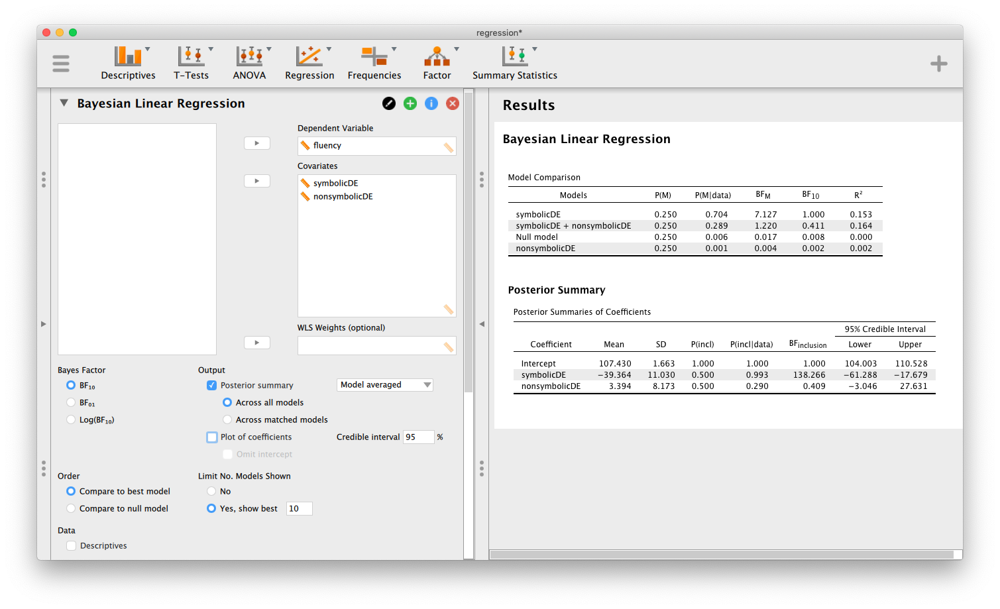

```{r start, include = FALSE}
library(papaja)
```

Like any other discipline within the psychological and behavioral sciences, researchers in numerical cognition rely on statistical inference, and hypothesis testing in particular, to verify theoretical claims against observed data. In recent years, Bayesian inference has become increasingly popular as an alternative to classical null hypothesis significance testing (NHST). Bayesian inference operates under a fundamentally different framework from NHST; instead of hard "accept/reject" decisions about a null hypothesis, Bayesian inference works by quantifying evidence about competing hypotheses in light of observed data. Hypotheses that do a better job of predicting data will receive increased support, whereas hypotheses that do not predict the data well will receive decreased support.

Despite its many advantages over NHST and increased calls for its use, the Bayesian approach is still relatively underutilized in the social sciences [@vandeschoot2017systematic]. One of the possible reasons for this lack of adoption may stem from the fact that Bayesian statistics is rarely taught in applied statistics courses. As a result, some researchers may not feel confident in their ability to apply these methods to their own problems of interest. Also, standard statistical software packages did not include routines for Bayesian inference, and so performing Bayesian inference in the past often required sophisticated programming skills.

In this tutorial paper, we will introduce the reader to the basics of Bayesian inference through the lens of some classic, well-cited studies in numerical cognition. In three detailed examples illustrating \( t \)-tests, linear regression, and ANOVA, we will walk the reader through performing and interpreting the results of Bayesian analyses using the software package JASP [@jaspSoftware]. JASP is a free, open-source statistical software package offering the user the option of both Bayesian and frequentist analyses, all housed within a familiar, easy-to-use graphical user interface. Below we give a brief introduction to Bayesian hypothesis testing, followed by the three tutorial examples.

# Introduction to Bayesian hypothesis testing
In this section, we will review and elaborate on the concept of hypothesis testing. Even though the reader of this paper is probably familiar with the general concept of hypothesis testing, we believe that it is nonetheless instructive to go over the basics.

## Hypotheses
Hypothesis testing can be viewed as a process of validating general claims based on a small sample of the general population. To illustrate, suppose that we are policy makers confronted with a new study programme which claims to increase the mathematical abilities of sixth graders in the United States. To ease the exposition we use a (fictitious) scale called the Scale for Advancing Mathematical Ability (SAMA) to measure mathematical ability. As policy makers we know that the population mean SAMA score is \( \mu_{0}=50 \) and that the standard deviation is \( \sigma=10 \) for the population of sixth graders that are taught using the standard materials in the US.

The superiority claim about the new study programme can be formalized as the working hypothesis \( \mathcal{H}_{1} : \mu > 50 \). Here \( \mu \) refers to the \emph{population} mean of SAMA score of the same sixth graders, but taught using the new study program instead. Such a treatment population does not (yet) exist and \( \mu \) cannot be measured, and is, therefore, unknown.

Nonetheless, we would like to infer the validity of the working hypothesis \( \mathcal{H}_{1} \) by running an experiment in which, say, \( n=90 \) sixth graders are taught with the new study programme. Suppose that these particular participants scored an average SAMA score of \( \bar{y} = 52.07 \). Clearly, this sample mean is larger than the status quo population mean of \( 50 \), but can we assume that this finding generalizes to the whole population? If the answer is "yes" and we declare the working hypothesis to be verified, then how confident would we be about such a decision? Below we recall how \( p \)-values are typically used to make hard "yes" and "no" decisions, and we remind the reader why a \( p \)-value does not quantify the (un)certainty of such decisions.

## Statistical models
To deduce how hypotheses, i.e., claims about the population such as \( \mu \), affect the data, such as \( \bar{y} \), we have to link the former to the latter with a distribution. For instance, let us suppose a normal distribution provides this link. The population parameters, the distribution that links them to the data, and the data together make up a (statistical) model, which allows for quantitative predictions. For instance, the claim that the treatment population is identitical to the current population of sixth graders implies the null model \( \mathcal{M}_{0} \) comprised of (1) the null hypothesis \( \mathcal{H}_{0}: \mu = 50 \), (2) the assumption \( \sigma = 10 \), and (3) normally distributed SAMA scores. When all three assumptions hold true, we can mathematically deduce that the \emph{potential} average SAMA score for a group of \( n = 90 \) participants is expected to fall within the interval \( 47.93 = 50 - 1.96 \frac{10}{\sqrt{n}} \) and \( 52.07 = 50 + 1.96 \frac{10}{\sqrt{n}} \) with 95% chance.<!--
-->
\footnote{We use ``chance'' to refer to probabilistic statements about the data.}
<!--
-->

## Null hypothesis significance testing
Reasoning from the general population by deriving statements about potential data outcomes under the assumption that the parameters are known forms the basis of null hypothesis signficance testing. By definition, the \( p \)-value is the chance of seeing the observed outcome and more extreme --but \emph{unobserved}-- outcomes under the null.

Under the null model \( \mathcal{M}_{0} \), the more extreme data are potential outcomes of \( \bar{y} \) larger than the observed sample mean of \( 52.07 \), but also lower than the unobserved possible sample mean of \( 47.93 = 50 - (52.07-50) \) (i.e., a potential sample mean that is less than, but equally far from, the hypothesized mean of 50) . Under the null, and the normality assumption in particular, we can deduce that the chance of seeing a potential \( \bar{y} \) in \( (- \infty, 47.93] \) or \( [52.07, \infty) \) is 5%, thus, \( p=0.05 \). Note that \( 1 - p = 0.95 \), which is the 95% chance of the non-extreme event of having \( \bar{y} \) fall within the interval \( [47.93, 52.07] \), if the null model holds true. We use this example to emphasize that \( p \)-values help us reason from the null model to (potential) data, but they do not allow us to do the reverse; that is, make quantitative statements from the actually observed data about the hypotheses.

A small \( p \)-value has many potential causes, and for this case we mention four: (1) the null hypothesis is not true; (2) the true variance is actually higher than \( 10 \); (3) the data are not normally distributed; or (4) the null model actually holds true, but we saw a rare event. Despite the various causes of a small \( p \), typically only (1) is singled out and mentioned as \emph{the} culprit. The typical conclusion is then to reject the null, and the working hypothesis \( \mathcal{H}_{1} :  \mu > 50 \) is proposed as the winner. Note that this type of reasoning provides only an indirect argument for our working hypothesis, as the predictions of the working hypothesis itself were not considered at all. Only the null was used in the computation of \( p \). The fact that the null is not a good fit for the data, does not automatically imply that the alternative fit the data well.

We conclude our brief review on \( p \)-values with three observations: (i) \( p \)-values only allow us to deduce predictions from the general population to potential data, but not the other way around; (ii) the comparison between \( \mathcal{H}_{0} \) and \( \mathcal{H}_{1} \) is unfair in the sense that \( p \)-values only consider one side of the coin (namely, the fit of \( \mathcal{H}_{0} \)), and thus, support for \( \mathcal{H}_1 \) is only ever indirect; and (iii) traditional practice\footnote{From the Fisherian point of view, $p$-values are considered as a continuous measure of evidence against the null. However, in the Neyman-Pearson testing framework, the null is accepted or rejected based on whether the test statistic reaches some critical value. In practice, researchers have mixed these paradigms, leading to the common practice of using $p$-values as a basis for making accept/reject decisions. } with \( p \)-values can only lead to hard reject or non-reject decisions, which encourages "black and white" thinking and ignores the nuances of a scientific enquiry. On this issue, @rozeboom1960 writes

\begin{quote}
The null-hypothesis significance test treats "acceptance" or "rejection" of a hypothesis as though these were decisions one makes. But a hypothesis is not something, like a piece of pie offered for dessert, which can be accepted or rejected by a voluntary physical action. Acceptance or rejection of a hypothesis is a cognitive process, a degree of believing or disbelieving which, if rational, is not a matter of choice but determined solely by how likely it is, given the evidence, that the hypothesis is true (p. 422-423).
\end{quote}

In a similar vein, @jeffreys1939theory1 offered the following critique of null-hypothesis significance testing:

\begin{quote}
Modern statisticians have developed extensive mathematical techniques, but for the most part have rejected the notion of the probability of a hypothesis, and thereby deprived themselves of any way of saying precisely what they mean when they decide between hypotheses (p. v).
\end{quote}

Though there are many other problems with $p$-values [see @wagenmakers2007], we contend that the key point is the neglect of any indication of support for $\mathcal{H}_1$. One way to remedy this is to consider Bayesian hypothesis testing as an alternative.

## Bayesian evidence as relative predictive performance
To address these problems, we can use Bayesian hypothesis testing, which gives us the ability to quantify evidence by comparing the *relative predictive performance* of both $\mathcal{H}_0$ and $\mathcal{H}_1$. Compared to null-hypothesis testing, Bayesian testing adds the missing piece $p(\text{data}\mid \mathcal{H}_1)$, which indexes the predictive performance of $\mathcal{H}_1$. We then quantify the relative predictive performance by computing the *Bayes factor* [@kass1995],
\[
\text{BF}_{10} = \frac{p(\text{data}\mid\mathcal{H}_1)}{p(\text{data}\mid\mathcal{H}_0)},
\]
which indexes the relative adequacy of both hypotheses as predictors of our observed data. One immediate benefit of the Bayes factor is ease of interpretation. For example, if $\text{BF}_{10}=5$, this tells us that our data are 5 times more likely to be observed under $\mathcal{H}_1$ than $\mathcal{H}_0$. Thus, we go beyond $p$-values by simultaneously assessing the predictive adequacy of *both* hypotheses, not just $\mathcal{H}_0$.  Of course, in order for $\mathcal{H}_1$ to make predictions, we have to be specific about what is meant by "$\mu>50$". Because we are rarely certain about what "$\mu>50$" means exactly, we place a *prior* distribution on the parameter $\mu$. We will specify more about this in later when we get to specific tests, but in general, the prior allows us to express our uncertainty about the values of $\mu$ under $\mathcal{H}_1$. For now, please note that this prior is a technical piece that is necessary for computing the Bayes factor. 

## Bayes factor interpretations
Typically, the Bayes factor is denoted as \( \text{BF}_{10} \), where the 1 in the subscript refers to the alternative model, and the 0 to the null model. Bayes factors range from zero to \( + \infty \), and \( \text{BF}_{10} = 8 \) implies that the observed data are 8 times more likely under the alternative compared to the null model. For Bayes factors smaller than one, we typically take the reciprocal to make them easier to interpret. For instance, \( \text{BF}_{10} = 0.2 \) is easier interpret as \( \text{BF}_{01} = 1/\text{BF}_{10} = 5 \), which means that the observed data are 5 times more likely under the null compared to the alternative. Bayes factors are best viewed as a continuous measure of evidence. In general, a value of \( \text{BF}_{10} \) larger than one is perceived to provide evidence for the alternative against the null. <!--Also, if \( \text{BF}_{10} \) grows to \( \infty \), the posterior model probability \( P(\mathcal{M}_{1} \mid d) \) grows to one, thus the more certain we will be about the adequacy of the alternative.-->

Unlike the \( p \)-value, there are no universal standards for when a Bayes factor provides a sufficient amount of evidence. However, people have made recommendations in the past regarding sizes of Bayes factors, and these provide us with a helpful, but very rough guideline on its interpretation, when we do not know the context of the problem. In particular, we mention the recommendations of @jeffreys1961, who proposed the following scheme<!--
-->
\footnote{We advise readers not to get too hung up on the specific labels and breakpoints in this table, see also @giollaInpresswhat .}:

\begin{center}
\begin{tabular}{rl}
Bayes factor & Evidence\\
\hline
1-3 & anecdotal\\
3-10 & moderate\\
10-30 & strong\\
30-100 & very strong\\
\( > \)100 & extreme\\
\end{tabular}
\end{center}

In principle, the Bayes factor does not come with a specified decision rule. We believe that context made explicit using prior model probabilities by field experts are much more important, than overly generalized "rules" such \( p < 0.05 \) or \( \text{BF} _{10} > k \), where \( k \) is some arbitrarily chosen number.

It is also worth nothing that a Bayes factor is simply a quantity which measures relative evidence between two models. It is completely independent of our prior beliefs in the two hypotheses $\mathcal{H}_0$ and $\mathcal{H}_1$. To incorporate the Bayes factor (relative predictive performance) with these beliefs (i.e., the prior model probabilities), we need Bayes' rule.

## Bayesian belief updating

Bayes' rule mathematically expresses the most basic idea in science; namely, that our prior belief in a hypothesis, $p(\mathcal{H})$, is updated after observing data to a *posterior* belief $p(\mathcal{H}\mid \text{data})$ in the following way:

\[
\underbrace{P(\mathcal{H}\mid \text{data})}_{\substack{\text{Posterior belief}\\ \text{about hypothesis}}} = \underbrace{P(\mathcal{H})}_{\substack{\text{Prior belief}\\ \text{about hypothesis}}} \times \underbrace{\frac{P(\text{data}\mid \mathcal{H})}{P(\text{data})}}_{\text{predictive updating factor}}.
\]

Since our goal is to directly compare the predictive adequacy of two hypotheses $\mathcal{H}_0$ and $\mathcal{H}_1$, we can employ Bayes' rule twice to derive the following:

\begin{align*}
  \frac{P(\mathcal{H}_1\mid \text{data})}{P(\mathcal{H}_0\mid \text{data})}
  & = \frac{P(\mathcal{H}_1) \cdot \frac{P(\text{data}\mid \mathcal{H}_1)}{P(\text{data})}}{P(\mathcal{H}_0) \cdot  \frac{P(\text{data}\mid \mathcal{H}_0)}{P(\text{data})}} \\ 
  & = \frac{P(\mathcal{H}_1)\cdot P(\text{data}\mid \mathcal{H}_1)}{P(\mathcal{H}_0)\cdot P(\text{data}\mid \mathcal{H}_0)},\\
\end{align*}

which we can simplify to

\[
\underbrace{\frac{P(\mathcal{H}_1\mid \text{data})}{P(\mathcal{H}_0\mid \text{data})}}_{\substack{\text{posterior beliefs}\\ \text{about hypotheses}}} = \underbrace{\frac{P(\mathcal{H}_1)}{P(\mathcal{H}_0)}}_{\substack{\text{prior beliefs}\\ \text{about hypotheses}}} \times \underbrace{\frac{P(\text{data}\mid \mathcal{H}_1)}{P(\text{data}\mid \mathcal{H}_0)}}_{\text{predictive updating factor}}, 
\]

or equivalently,

\[
\frac{P(\mathcal{H}_1\mid \text{data})}{P(\mathcal{H}_0) \mid \text{data})} = \frac{P(\mathcal{H}_1)}{P(\mathcal{H}_0)} \times \text{BF}_{10}. 
\]

This gives us a lovely way to remember another fundamental fact of Bayesian hypothesis testing; that is, *posterior odds = prior odds $\times$ BF*. Thus, not only does the Bayes factor assess the relative predictive performance of two hypotheses, it also indexes the factor by which our relative belief in the two hypotheses can be updated after observing data.

Now we come back to our earlier example of the SAMA test for mathematical ability and demonstrate these ideas in context. Working as policy makers, we might have seen many claims of improved study programs that did not work out well. For instance, if past claims of improved study programmes led to null results four times out of five, we might place 4-to-1 odds against the claim of improvement and thus set \( P( \mathcal{H}_{1}) = 0.2 \) and \( P(\mathcal{H}_{0}) = 0.8 \). On the other hand, the designers of the new study programme to increase SAMA scores might feel strongly about the benefits of their programme, and so might choose \( P( \mathcal{H}_{1}) = 0.7 \) and \( P(\mathcal{H}_{0}) = 0.3 \) instead. If \( \mathcal{H}_{1} \) and \( \mathcal{H}_{0} \) are the only models under consideration we have \( 0 < P( \mathcal{H}_{0}) < 1 \) and \( P( \mathcal{H}_{1})= 1 - P( \mathcal{H}_{0}) \). The Bayes factor \( \text{BF}_{10}(d) \) can then be used to update these prior model probabilities to posterior model probabilities, as follows:

\begin{equation}
\label{eqPriorToPosterior}
P(\mathcal{H}_{1} \mid \text{data}) = \frac{ \text{BF}_{10} P(\mathcal{H}_{1})}{\text{BF}_{10} P(\mathcal{H}_{1}) + P(\mathcal{H}_{0})} \text{, and } P(\mathcal{H}_{0} \mid \text{data}) = 1 - P(\mathcal{H}_{1} \mid \text{data}).
\end{equation}

For illustration, suppose that we found \( \text{BF}_{10} = 5 \). Then the sceptic (who set $P(\mathcal{H}_1=0.2$ before seeing the data) increases their belief in the superiority of the new study programme to 56%, i.e., \( P(\mathcal{H}_{1} \mid \text{data})=0.56 \), and retains 44% probability of for the null after data observation. On the other hand, the same \( \text{BF}_{10} = 5 \) results in the proponent of the new study programme (who set $P(\mathcal{H}_1)=0.7$ beofre seeing the data) to report a posterior model probability of \( P(\mathcal{H}_{1} \mid \text{data})=0.92 \) and \( P(\mathcal{H}_{0} \mid \text{data})=0.08 \) instead. Note that the posterior model probabilities combine what we believed prior to data observation with the evidence of the data in terms of the Bayes factors. Both sceptic and the proponent could, if they wish, declare the new study programme to be superior to the status quo, but the sceptic would be much less confident than the proponent. The resulting posterior model probabilities can, thus, be used to complement a decision with a measure of uncertainty.

# Bayesian hypothesis testing: How it works

While the goal of this paper is to provide some concrete examples of Bayesian hypothesis testing in numerical cognition, before doing so we will discuss *how* Bayesian hypothesis tests work in conceptual terms. The technical details of each test we will demonstrate are provided in a supplementary document, downloadable from https://git.io/JeXui, but the reader need only consult these details if interested. 

As a general method, Bayesian hypothesis testing gives us several pragmatic benefits, each of which will be highlighted in our examples below. The first of these is the ability to quantify evidence on a continuous scale.<!--For a given set of observed data, the Bayes factor indexes the relative predictive adequacy of $\mathcal{H}_0$ and $\mathcal{H}_1$. For example, if $\text{BF}_{10} > 1$, the data are more likely under $\mathcal{H}_1$ than they are under $\mathcal{H}_0$, and are thus evidential for $\mathcal{H}_1$. Further, the value of the Bayes factor indexes the amount of this evidence on a continuous scale.--> A second benefit is the ability to differentiate between *evidence of absence* and *absence of evidence*. Recall that in traditional null hypothesis testing, failure to reject $\mathcal{H}_0$ cannot be taken as evidence for a null effect. In this instance, it is not clear whether our data provide evidence for $\mathcal{H}_0$ (i.e., evidence of absence) or our data are simply not evidential for either hypothesis (i.e., absence of evidence). The Bayes factor gives us the ability to separate these two ideas. For example, if $\text{BF}_{01}$ is large, we take this to represent evidence for the null -- that is, evidence for the absence of something.  Another benefit include the ability for the researcher to monitor evidence as the data accumulate. Though problematic for inference based on $p$-values, optional stopping does not affect the interpretation of Bayesian analyses [@rouder2014optional]. Thus, researchers may continuously monitor the "evidential flow" of their data and choose to stop whenever evidence is sufficiently compelling. Finally, Bayesian methods integrate testing with estimation, allowing the researcher to not only measure the evidence for one hypothesis over another, but to simultaneously obtain a probabilistic estimate of the effect size under the hypothesis that it is non-zero.

Given these benefits, what does a Bayesian hypothesis test require of the researcher? Like any hypothesis testing situation, the researcher must specify a null hypothesis $\mathcal{H}_0$ and an alternative hypothesis $\mathcal{H}_1$. In a Bayesian context, though, there are some specific considerations that govern how this choice is made. Essentially, the researcher must specify a *prior distribution* of effect sizes that are expected under $\mathcal{H}_1$. This allows $\mathcal{H}_1$ to makes predictions that can be evaluated against observed data. For example, the Bayesian $t$-test of @rouder2009bayesian uses a Cauchy distribution with scale $r=1/\sqrt{2}$ as a default choice\footnote{This prior satisfies several desirable properties for an objective, default prior; see the supplemental material for details.} for the prior distribution of effect sizes that are expected *if* there is a nonzero effect. Given this definition of $\mathcal{H}_1$ (i.e., as a distribution of effect sizes $\delta$), the null hypothesis $\mathcal{H}_0$ is specified as a specific point within this distribution, namely $\delta=0$. Thus, we can succinctly encode our hypotheses as:

\begin{align*}
\mathcal{H}_0: \delta &=0\\
\mathcal{H}_1: \delta &\sim \text{Cauchy}(1/\sqrt{2}),\\
\end{align*}

Given this specification, we can use JASP to perform all necessary calculations "under the hood". Note that the specification of the prior distribution of effect sizes under $\mathcal{H}_1$ can be done differently, including choosing priors based on earlier experiments [@verhagen14bayesian,@ly2019replication] or on general knowledge about a domain [i.e., informed priors; @gronau2019]. However, we strongly recommend that researchers start their analysis with the *default priors* that are provided by JASP. These form a good reference point, and as one's Bayesian expertise develops (or if one has strong prior knowledge) then additional analyses can be performed.


# Tutorial examples
In the remainder of the paper, we describe a number of practical examples of using Bayesian inference in the context of numerical cognition. In the examples, each based on a well-cited paper in numerical cognition, we demonstrate a number of JASP's features using synthetic data sets, each generated in R using specific model assumptions that closely match the patterns of observed data described in the original papers. The data sets, as well as the R script used to generate the data sets, are available for download from https://git.io/JeXui.

# Example 1: a Bayesian \( t \)-test
To demonstrate the Bayesian \( t \)-test, we use a data set based on @vergutsDeMoor2005, who investigated whether two-digit numbers are represented holistically on a mental number line, or instead are processed by decomposing into separate digit components. In their experiment, @vergutsDeMoor2005 presented subjects with pairs of two-digit numbers who had the same decade (e.g., 53 versus 51) or decades that differed by one (e.g., 53 versus 61). Their reasoning for this manipulation was as follows: if subjects are using holistic processes to compare two-digit numbers, then they should exhibit a numerical distance effect [@moyer1967] on same-decade as well as different-decade pairs. That is, response times should be faster when the numerical distance between the two numbers is large, and slower when the numerical distance is small. If, on the other hand, subjects are using decomposed processes, this numerical distance effect should disappear on the different-decade pairs. This is because in different-decade pairs, such as 53 versus 61, the comparison can be made solely on the basis of the decade digit alone. Thus, response times in this condition should be immune to manipulation of numerical distance.

In their original paper, @vergutsDeMoor2005 found support for decomposed processing on the basis of several single sample \( t \)-tests. For subjects asked to choose the smaller of the digit pairs, they found (as expected) a statistically significant numerical distance effect for same-decade pairs, \( t(22) = -3.86 \), \( p<0.001 \). However, the distance effect was not significantly different from 0 for different-decade pairs, \( t(22)=-0.14 \), \( p=0.884 \). A similar pattern was found for subjects who were asked to choose the larger of each pair: there was a significant distance effect for same-decade pairs, \( t(19)=-5.31 \), \( p<0.001 \), but no significant distance effect for different-decade pairs, \( t(19)=0.70 \), \( p=0.479 \).

## Executing the $t$-test in JASP
We will now describe a Bayesian analysis inspired by the original methods of @vergutsDeMoor2005. After downloading the file \texttt{ttest.csv} from the Github repository (https://git.io/JeXui), you can open the file in JASP by clicking the menu button -- "Open" -- "Computer", which will then open a file browser for you to locate the downloaded file on your computer. Once the file is opened, you will be able to see a data set with three variables (see Figure \@ref(fig:ttestData). The variable \texttt{condition} defines whether a participant was instructed to choose the smaller or the larger of each presented two-digit number pair. The variable \texttt{distSame} represents each participant's slope after regressing response times against numerical distance [c.f., @lorch1990] for same-decade pairs. Note that a negative slope is indicative of the numerical distance effect, as response times decrease as a function of increasing numerical distance. Finally, \texttt{distDifferent} represents each subject's regression slope for different-decade pairs.

{width=65%}

Similar to @vergutsDeMoor2005, we are interested in whether the mean of the regression slopes (collapsed across participants by condition) depends on the type of decade pair being compared. Specifically, the decomposed processing account leads us to predict that for same-decade pairs, the numerical distance effect (indexed by mean slope) will be negative, whereas for different-decade pairs, the numerical distance effect will be 0. As a first step, we can easily obtain some descriptive statistics. In JASP, click on the "Descriptives" in the ribbon at the top, then click "Descriptive Statistics" in the dropdown menu. This will open a dialogue box showing the list of variables available in our data set. Highlight \texttt{distSame} and \texttt{distDifferent}, then click the right-facing arrow to move these into the "Variables" box. Immediately, some descriptive statistics will appear on the right side of the screen under "Results". We can also construct a boxplot (with jittered datapoints included) for each of the variables, split by condition, by clicking on the "Plots" menu and selecting "Boxplots" and "Boxplot element" and "Jitter element" (see Figure \@ref(fig:ttestDescriptives)). Immediately, we can see that the slopes are mostly negative for same-decade pairs (the top boxplot in Figure \@ref(fig:ttestDescriptives)); this is indicative of a numerical distance effect for the same-decade pairs. However, the slopes are centered at 0 for the different-decade pairs (the bottom boxplot), indicating no numerical distance effect for these pairs. Thus, the data initially seem to support the decomposed processing narrative of @vergutsDeMoor2005.

{width=90%}

We are now ready to perform a Bayesian analysis of the simulated @vergutsDeMoor2005 data. First, since we will separately analyze the "Choose smaller" and "Choose larger" groups, we will need to apply a *filter* to the data set; specifically, we will first consider only the "Choose smaller" group. There are several ways to do this in JASP, but the easiest is the "click filter"<!--
-->
\footnote{For a demonstration of the different methods of filtering in JASP, see https://jasp-stats.org/2018/06/27/how-to-filter-your-data-in-jasp/.}<!--
-->
First, click the header of the \texttt{condition} column. To remove all of the \texttt{larger} trials from the analysis and retain only the \texttt{smaller} trials, we simply "turn off" the \texttt{larger} value by clicking on the check mark next to it. The check mark will be replaced by a cross, and you will be able to see that the \texttt{larger} trials have been greyed out. The filter dialog can be closed by clicking on the X on the right side of the dialog box. Notice that a funnel icon will appear next to the \texttt{condition} column header to indicate that a filter is currently being applied. Any filters can be removed by re-opening the filter dialog and clicking the eraser icon.

To perform a Bayesian one-sample \( t \)-test, click on the "T-Tests" button in the ribbon at the top, and select "Bayesian One Sample T-Test". There are two \( t \)-tests that we wish to perform, but for clarity, we will start with describing one in detail. We will first perform a \( t \)-test for the same-decade trials. From the variable list, move "distSame" over to the "Variables" box. Immediately, JASP will output a Bayes factor of $\text{BF}_{10}=4.547$. However, let us look more closely. Note that under the "Alt. Hypothesis" list, the option "$\neq$ Test value" is selected by default. Thus, this Bayes factor is for a two-sided alternative, $\mathcal{H}_1:\mu \neq 0$. But the numerical distance effect is expected to be negative, we instead we should consider the one-sided alternative $\mathcal{H}_{-}:\delta < 0$, where the minus in the subscript reminds us that the alternative is one-sided negative. Thus, we choose "\( < \) Test value" from the "Alt. Hypothesis" menu. Immediately, we see that the Bayes factor increases to 9.027; this indicates the importance of properly specifying the correct alternative hypothesis. Finally, select also "Prior and posterior" from the "Plots" menu. This setup and the resulting output appears in Figure \@ref(fig:ttestBayes). There are two components of this output that we now discuss in detail: the computed Bayes factor (top of the Results pane in Figure \@ref(fig:ttestBayes)) and the plot of the prior and posterior for the effect size parameter \( \delta \) (bottom of the Results pane in Figure \@ref(fig:ttestBayes)).

{width=90%}

As mentioned above, the Bayes factor is \( BF_{-0}=9.027 \), which indicates that the observed data are approximately 9 times more likely under the alternative hypothesis \( \mathcal{H}_{1} \) than under the null hypothesis \( \mathcal{H}_{0} \). According to the convention of Jeffreys (1961), this is considered "moderate" evidence for \( \mathcal{H}_{1} \), which states that the true population effect \( \delta \) (from which our participants' regression slopes are drawn) is negative. A useful visual display of this Bayes factor is provided in the plot in the bottom of 9.027-to-1 in favor of \( \mathcal{H}_{1} \) over the null.<!--
-->
\footnote{To simplify matters, we identify the hypotheses to the models and use the notation \( \mathcal{H}_{k} \) interchangeably with \( \mathcal{M}_{k} \) for the \( k \)th model.}<!--
-->
The bottom plot shows this in more detail. The dashed line depicts the aforementioned Cauchy prior (with a default scale/prior width of \( r=1/\sqrt{2} = 0.707 \)) on the population effect size \( \delta \), but restricted to negative values in accordance to the alternative \( \mathcal{H}_{-} \). The solid line depicts the posterior density for \( \delta \). Under the assumption that the effect cannot be positive, this density provides a measure of uncertainty about the size of the population effect \( \delta \) *after* observing the data. We can see in Figure \@ref(fig:ttestBayes) that the more probable values of \( \delta \) are now centered around \( \delta = -0.5 \). For the testing problem, one specific value worth exploring is \( \delta=0 \). Notice that relative to the prior, the \( y \)-coordinate at \( \delta=0 \) in the posterior is smaller than the \( y \)-coordinate at \( \delta=0 \). This reflects the fact that our posterior belief regarding \( \mathcal{H}_{0} : \delta = 0 \) has decreased after data observation. In fact, it has decreased by a factor of approximately 9, which is the Bayes factor we obtained. This relationship is no accident; For the \( t \)-test the Bayes factor can be represented as the ratio of the prior and posterior on the population effect \( \delta \) evaluated at the null hypothesis \( \mathcal{H}_{0}: \delta = 0 \). This fact is known as the Savage-Dickey density ratio [@wagenmakers2010].

In Figure \@ref(fig:ttestBayes) we are also provided information about the magnitude of \( \delta \) in the form of a 95% credible interval of [-0.962, -0.110]. This means that if the population effect is assumed to be negative --thus, under the implicit assumption that the null is false-- then with 95% probability, the true value of the population effect \( \delta \) is between -0.962 and -0.110. Note that while it is tempting to use this estimate as a replacement for the inference that is afforded by the Bayes factor, this approach is simply not valid [@jeffreys1939theory1, @berger1987testing, @WagenmakersEtAlPredictiveIrrelevancesubm]. The credible interval presented here is *conditional on \( \mathcal{H}_{-} \)*, so it only makes sense *if* \( \mathcal{H}_{-} \) is the true model. Before interpreting the credible interval, we must perform a test to index support for \( \mathcal{H}_{-} \) over \( \mathcal{H}_{0} \). So, when reporting the credible interval, we should report the Bayes factor *first*, then we can report the credible interval. Do not be tempted to report the credible interval without the Bayes factor!

Another question to consider in our analysis is how sensitive the Bayes factor is to changes in the specification of the Cauchy prior on the population-level effect size \( \delta \). Clicking the box for "Bayes factor robustness check" will help us to answer this question. Figure \@ref(fig:ttestRobust) displays the result of this robustness check. As mentioned before, the default prior for \( \delta \) is a Cauchy distribution centered around \( 0 \) with scale (or "width") \( r=0.707\). Figure \@ref(fig:ttestRobust) depicts how the Bayes factor changes with varying values of \( r \). The plot represents the Bayes factor as a continuous function of \( r \), and the legend at the top lists the Bayes factor at four values: the value of \( r \) that produces the maximum Bayes factor, the original user-specified prior (\( r=0.707 \)), a "wide" prior (\( r=1 \)), and an "ultrawide" prior (\( r=\sqrt{2}=1.414 \)). This plot should be interpreted holistically --across a wide range of values for the prior scale \( r \), the resulting Bayes factor ranges from 6.3 to 9, which implies that the result is quite robust.

{width=60%}

Now we are ready to perform a Bayesian \( t \)-test for the different-decade trials. Recall that these were the critical trials for @vergutsDeMoor2005, as a null numerical distance effect would lend support for a strictly decomposed model of two-digit number processing. We perform this test in an identical manner to the previous test, with one exception. After moving the variable \texttt{distDifferent} to the "Variables" list, we select \( \text{BF}_{01} \) from the "Bayes Factor" menu. Note that this is not strictly necessary to perform the analysis, but doing so will cast our Bayes factor in terms of support for our working hypothesis \( \mathcal{H}_{0} \) over \( \mathcal{H}_{-} \). The result is shown in Figure \@ref(fig:ttestBayes2). We obtain \( \text{BF}_{0-}=7.595 \), indicating that our data are approximately 7.5 times more likely under \( \mathcal{H}_{0} \) than \( \mathcal{H}_{-} \). This shows some evidence that the true population effect \( \delta \), from which our synthethic data were generated, is equal to 0. As we can see in Figure \@ref(fig:ttestBayes2), our posterior belief that \( \delta=0 \) has *increased* relative to our prior belief that \( \delta=0 \), specifically by a factor of 7.595.

{width=90%}

It is again important to note that the 95% credible interval that is displayed in the figure is conditional on \( \mathcal{H}_{-} \). In other words, it only makes sense if \( \mathcal{H}_{-} \) is the true model. However, in this case, we have moderate evidence that \( \mathcal{H}_{0} \) is the true model, so we can ignore this credible interval [@jeffreys1939theory1]. Conditioned on the null \( \mathcal{H}_{0} \) our best guess for size of the effect would simply be \( \delta = 0 \). <!--After all, what sense is there in having a range of probable values for \( \delta \) if our most preferred model is the one in which the value of \( \delta \) is specified to be 0?--> It is also worth mentioning that there might be some confusion present when to take this credible interval at face value. Some might argue that since the credible interval does not contain 0 (its right endpoint is -0.004), this is actually evidence for \( \mathcal{H}_{-} \). However, this is simply not true. The apparent paradox lies in how the credible interval is computed; in JASP the 95% credible interval is computed as the *central* 95% of the mass of the posterior for \( \delta \). Since there is no posterior mass to the right of \( \delta=0 \), this central portion of the posterior must necessarily be contained strictly to the left of \( \delta=0 \), thus producing the right end point that is slightly less than \( \delta=0 \). However, if we were to instead specify the credible interval as 95% of the posterior distribution with *highest density*, the resulting credible interval would contain \( \delta=0 \). Currently, this functionality is not available in JASP, so great care must be taken in interpreting the credible interval for \( \delta \) based on restricted priors.

<!--@Tom, this is how I normally view this. Furthermore, in linear regression, we can discuss how the uncertainty of the testing problem and the uncertainty of the estimation are combined. -->
What is important to realize is that a test addresses a different question than an estimation. The Bayes factor focuses on the question "Does the effect exist?", whereas the posterior focuses on the question "If it exists, then how large is it?". This is why the (Bayesian) testing problem compares the model where the population effect is fixed at zero against one where it is free to vary. Once the data have convinced us that the population effect \( \delta \) varies freely, only then would we be interested in the magnitude of the effect [@haaf2019].

Additionally, one might want to see how evidence changes over time as data are collected. JASP gives us the ability to monitor this evidential flow with the "Sequential analysis" plot. The resulting plot shows the progression of the Bayes factor over time; see Figure \@ref(fig:ttestSequential). This plot shows how the Bayes factor changes sequentially as each data point is added, starting from \( \text{BF}_{0-}=1 \) (no preference for either model) at \( n=1 \) to the obtained Bayes factor of \( \text{BF}_{01}=7.595 \) at \( n=23 \). Notice that the plot provides both the Bayes factor (on a logarithmic scale) and a verbal label of evidence for each region, corresponding to the recommendations of @jeffreys1961 that we referenced earlier. If these were real data, we might prefer to continue sampling additional participants until the Bayes factor stabilizes. Here, the definition of "stable" is unclear, but good practice would be to sample until the Bayes factor reaches 10, either in support of \( \mathcal{H}_{0} \) or \( \mathcal{H}_{-} \).

We can follow the same steps described above on the participants who were assigned to the "choose larger" condition. The inference is largely the same. For same decade trials, we obtain \( \text{BF}_{-0}=7.543 \), indicating that the data are approximately 7.5 times more likely under \( \mathcal{H}_{-} \) than under \( \mathcal{H}_{0} \). This provides some evidence that the true population effect \( \delta \) is negative, which is indicative of a negative numerical distance effect. For different decade trials, the inference is less clear; we obtain \( \text{BF}_{0-}=1.893 \), indicating that the observed data are approximately 2 times more likely under \( \mathcal{H}_{0} \) than under \( \mathcal{H}_{-} \). 

{width=60%}

Let us now recap what we have done here. Importantly, we have described how to conduct the Bayesian $t$-test in JASP, and through the example, we have demonstrated many of the pragmatic advantages of Bayesian analyses in general, going beyond what is afforded by traditional null hypothesis testing. First, we have quantified evidence for the specific hypotheses that were derived from the decomposed processing account of @vergutsDeMoor2005. That is, we showed that when people were given same decade trials, our data were approximately 9 times more likely under the hypothesis of a negative slope (i.e., the numerical distance effect) than under the null hypothesis. On the other hand, when people were given different decade trials, our data were approximately 7.5 times more likely under the null hypothesis (i.e., evidence of absence). Further, for same decade trials, where the alternative hypothesis received more support, we obtained an probabilistic estimate for $\delta$, the standardized effect size. Specifically, we reasoned that if $\mathcal{H}_-$ is the true model, there is a 95% probability that the effect size is between -0.962 and -0.110. Finally, we demonstrated sequential analysis, which allows the researcher to monitor evidential flow as data come in. In all, we went beyond what @vergutsDeMoor2005 were able to do with $p$-values alone, particularly regarding their conclusion of a null distance effect for different decade trials. 

Though the discussion throughout this example is designed to be instructive, most of the narrative we've used is also good for the reporting of Bayesian analyses. Practitioners who desire more guidance on the reporting of such analyses are encouraged to consult @doorn2019jaspguidelines.

# Example 2: a Bayesian linear regression
To demonstrate Bayesian linear regression, we use an example inspired by @hollowayAnsari2009, who examined the relationship between basic numerical processing and higher mathematical skills in children. Specifically, they examined whether childrens' mathematical achievement scores were related to their ability to compare symbolic and nonsymbolic number magnitudes. In this example, we will recreate one specific component of their analysis; namely, we will use Bayesian linear regression to examine the extent to which mathematical fluency scores are predicted by childrens' standardized symbolic and nonsymbolic distance effects. To operationalize these effects, @hollowayAnsari2009 subtracted the mean RT for large numerical distances from the mean RT for small numerical distances, and then standardized across individuals by dividing the resulting RT difference by the mean RT for large distances.<!--@Tom: I still have some problems understanding this. Is it correct that distance effects are defined as standardised difference of RT measurements? The fact that there are multiple conditions surprises me. It also suggests that this should have been studied as an ANOVA/ANCOVA. Perhaps we should put this information in a footnote and note that "In accordance to @hollowayAnsari2009 the standardized symbolic and nonsymbolic distance effects are defined as the individual's standardized difference of RT measurements." -->
In their original paper, @hollowayAnsari2009 found that the childrens' symbolic distance effect was a significant predictor of fluency, \( \beta = -0.236 \), \( p<0.05 \), whereas the nonsymbolic distance effect did not predict fluency, \( \beta=0.063 \), \( p > 0.05 \).

The questions we would like to address here are (1) "Which out of these two covariates (\( x_{1}=\text{ symbolic distance effect} \) and \( x_{2}=\text{ nonsymbolic distance effect} \)) predict fluency score?", and (2) "How large is the effect \( \beta_{i} \) of each covariate \( x_{i} \)?". Note that the first question can be answered by: (a) neither symbolic nor nonsymbolic, (b) only symbolic, (c) only nonsymbolic, and (d) both symbolic and nonsymbolic distance effects predict fluency score. Equivalently, these answers correspond to specific hypotheses about the regression coefficients \( \beta_{i} \), namely: (a') the coefficients for both symbolic and nonsymbolic are equal to 0; (b') only the coefficient for nonsymbolic is equal to zero; (c') only the coefficient for symbolic is equal to zero; and (d') neither coefficient is equal to zero. Cast in this manner, the first question is the testing problem, whereas the second question deals with the estimation problem.

The Bayesian linear regression procedure begins by considering the following four models:<!--
-->
\begin{align*}
\mathcal{M}_{0}: & \text{ fluency} = \text{Null model} \\
\mathcal{M}_{1}: & \text{ fluency} = \text{symbolicDE} \\
\mathcal{M}_{2}: & \text{ fluency} = \text{nonsymbolicDE} \\
\mathcal{M}_{3}: & \text{ fluency} = \text{symbolicDE}+\text{nonsymbolicDE}
\end{align*}<!--
-->
Here, $\mathcal{M}_0$ represents a model where neither symbolic nor nonsymbolic distance has any effect on fluency. For $\mathcal{M}_1$ and $\mathcal{M}_2$, *only* symbolic (respectively, nonsymbolic) distance has an effect on fluency. Finally, for $\mathcal{M}_3$, both symbolic and nonsymbolic distance have effects on fluency. As with our earlier example, our goal is to assess the predictive adequacy of each model. To do this, we must place prior distributions on the parameters in the model (see the supplementary text for details). For this context, the relevant parameters are the standardized regression coefficients $\beta_1$ and $\beta_2$, representing the "effects" of symbolic and nonsymbolic distance, respectively. In JASP, the default prior on these regression coefficients is a multivariate Cauchy distribution [see @rouder2012defaultRegression] -- conceptually, this is a generalization of the prior that we placed on effect size for the Bayesian $t$-test described earlier. This prior allows each model to make predictions (see supplement for details), which JASP then uses to assess how well each model predicts the observed data at hand. Below, we describe for the practitioner how to execute this procedure and interpret its rich output.

## Executing the Bayesian Linear Regression in JASP
After downloading the file \texttt{regression.csv} from the Github repository (https://git.io/JeXui), open the file in JASP. This will reveal a data set with three variables: \texttt{symbolicDE}, representing the standardized distance effect measure for the symbolic number comparison task; \texttt{nonsymbolicDE}, representing the standardized distance effect measure for the nonsymbolic comparison task; and \texttt{fluency}, representing the mathematics fluency score.

To perform the Bayesian linear regression, we click the "Regression" button and select "Bayesian Linear Regression". We then move the \texttt{fluency} variable to the "Dependent Variable" box and we move both the \texttt{symbolicDE} and \texttt{nonsymbolicDE} variables to the "Covariates" box. We will leave the basic defaults in place except for two. First, select "Posterior summary" under "Output". Also, we will select one more option that is found in the "Advanced Options", but will actually simplify our discussion for this tutorial. Under "Model Prior", select "Uniform".<!--We will explain why shortly.--> The output can be seen in Figure \@ref(fig:regression1).

{width=90%}

First, we will walk through the basic output given by JASP. Note that the basic functionality of JASP here is based on the R package BAS [@bas]. As can be seen in the output table in Figure \@ref(fig:regression1), JASP constructs the four models we described earlier (i.e., $\mathcal{M}_0, \dots, \mathcal{M}_3$). These models are each displayed in the rows of the output in Figure \@ref(fig:regression1) in decreasing order of posterior model probability (i.e., the model with the highest posterior model probability is listed at the top). We can see immediately that the best model is \( \mathcal{M}_{1} \), which posits that fluency is predicted only by the symbolic distance effect. But, to understand why it is the best model and how it compares to the other 3 models, we need to discuss what each of the columns in the output table represent.

The first column, \( P(M) \), lists the prior probabilities of the 4 models. Above, we specified that the prior model probabilities should be uniform. Under this option, JASP gives the models equal prior model probability. Since there are 4 models, the prior probability of each model is \( 1/4 = 0.25 \). The second column, \( P(M \mid \text{data}) \), gives the posterior model probabilities. Like the prior model probabilities, these must add to 1, but now there has been some shift from prior model probability to posterior model probability. Here, after observing data, we can see that \( \mathcal{M}_{1} \) and \( \mathcal{M}_{3} \) account for most of our posterior belief, with posterior probabilities 0.704 and 0.289, respectively. The remaining two models have very low posterior probability totalling 0.007.

Various Bayes factors are contained in the third and fourth columns. Each column gives a slightly different type of Bayes factor, however, and must be interpreted appropriately. The third column, \( \text{BF}_{M} \), gives the factor by which the prior odds for a given model have been updated to produce the posterior odds for that model. For example, consider \( \mathcal{M}_{1} \), the model where fluency is predicted only by the symbolic distance effect. The prior odds for \( \mathcal{M}_{1} \), which is defined as the probability that \( \mathcal{M}_{1} \) is the true model divided by the probability that \( \mathcal{M}_{1} \) is *not* the true model, can be computed as \( 0.25/(1-0.25) = 0.25/0.75 = 0.333 \). By similar calculation, the posterior odds are equal to \( 0.704/(1-0.704) = 0.704/0.296 = 2.378 \). Thus, the updating factor from prior odds to posterior odds is calculated as \( 2.378/0.333 = 7.127 \). One of the useful properties of this column is that it tells the user quickly whether the odds for a particular model has *increased* or *decreased*. As we can see in Figure \@ref(fig:regression1), the data has increased model odds for both \( \mathcal{M}_{1} \) and \( \mathcal{M}_{3} \), but only just slightly for \( \mathcal{M}_{3} \). In other words, we have increased our belief in the two models which contain symbolic distance as as predictor for fluency.

Finally, the fourth column, \( \text{BF}_{10} \), lists the Bayes factor for a given model compared to the most probable model (note that this is the default setting in JASP, but if desired, it can be changed by the user to instead display the Bayes factor compared to the null model).<!--
-->
\footnote{It is easy to compute the Bayes factor with respect to the most probable model, once we have the Bayes factor with respect to the null model. Let \( \text{BF}_{10}, \text{BF}_{20}, \text{BF}_{30} \) be the Bayes factors with respect to the null model. Recall that in our case model \( \mathcal{M}_{1} \) is the best model. By transitivity, \( \text{BF}_{31} =\text{BF}_{30} \text{BF}_{01} \), where \( \text{BF}_{01}= 1/\text{BF}_{10} \).} <!--
-->
This is a very useful column for doing specific model comparisons. For example, we can use this column to directly compare the two most probable models, \( \mathcal{M}_{1} \) and \( \mathcal{M}_{3} \). In the results table, we see that the Bayes factor for the \( \mathcal{M}_{3} \) compared to the best fitting model \( \mathcal{M}_{1} \) is 0.411. Taking reciprocals, this tells us that the Bayes factor for \( \mathcal{M}_{1} \) over \( \mathcal{M}_{3} \) is \( 1/0.411 = 2.43 \). In other words, the observed data are approximately 2.5 times more likely under the model where fluency is predicted only by the symbolic distance effect compared to the model where fluency is predicted by both symbolic and nonsymbolic distance effects. Another way of saying this is that we have positive evidence for excluding nonsymbolic distance effect as a predictor of mathematical fluency once we already accepted symbolic distance effect as a predictor.

Once we have positive evidence for \( \mathcal{M}_{1} \), which posits only symbolicDE as a predictor of fluency, we can move to the problem of estimation. To this end, we focus on two outputs: (1) the "Posterior Summary" output of Figure \@ref(fig:regression1); and (2) the "Marginal posterior distributions" plot (see Figure \@ref(fig:marginalPosterior)), which can be displayed by clicking on the "Plots" menu in JASP. Both outputs provide model averaged posterior summaries of the regression coefficients \( \beta_{0} \) (the intercept), \( \beta_{1} \) (the coefficient of symbolicDE), and \( \beta_{2} \) (the coefficient of nonsymbolicDE). Before interpreting these outputs, however, there are some subtle details that we should discuss. As mentioned earlier in the \( t \)-test example, any estimation that we present is conditional on *some* model. However, in this example, we have four models to consider. So, how to proceed? One approach is to employ Bayesian model averaging, which JASP performs by default. Basically, it works as follows. Rather than estimating a parameters conditioned on one specific model, JASP calculates an *average* posterior distribution for the parameter. That is, we factor in both the uncertainty about the parameter within any one particular model *and* the uncertainty about the models themselves. We think this is a good approach to estimation, as it alleviates the need for the researcher to pick one model as "the winner", and instead, provides estimates that incorporate both levels of uncertainty (within models and across models). For an accessible tutorial on Bayesian model averaging, see @hinneBMA.

{width=60%}

Given this background, let us first interpret the Posterior Summary table in Table \@ref(fig:regression1). First, the table provides estimates of mean and standard deviation for the three coefficients, as well as 95% credible intervals. Moreover, the table provides "inclusion probabilities", which provide prior and posterior probabilties of including each covariate as a predictor of the linear model. We can take a look at these in more detail. First, let us focus on \( P(\text{incl}) \), the prior inclusion probability for each covariate. These are based on the uniform prior model probabilities that we chose in the Advanced Options. Since the intercept \( \beta_{0} \) was included in each of the 4 models, and each model \( \mathcal{M}_{k} \) had prior probability 0.25, the prior probability of including the intercept \( \beta_{0} \) is equal to \( 4(0.25) = 1 \). On the other hand, only two of the models (\( \mathcal{M}_{1} \) and \( \mathcal{M}_{3} \)) included the covariate symbolicDE. Since each of these models had prior probability 0.25, the prior probability of including the predictor symbolicDE is equal to \(2(0.25) = 0.5\). A similar argument shows the same prior probability for the covariate nonsymbolicDE.

After observing data, we can calculate the posterior inclusion probabilities \( P(\text{incl}\mid \text{data}) \). This can be done easily by considering the posterior probability of each model in the "Model Comparison" table of Figure \@ref(fig:regression1). The intercept is in each of the models, so summing the posterior probabilities for all four models produces \( P(\text{incl}\mid \text{data}) = 1\). For symbolicDE, we sum the posterior probabilities for \( \mathcal{M}_{1} \) and \( \mathcal{M}_{3} \), which gives \( P(\text{incl}\mid \text{data}) = 0.704 + 0.289 = 0.993 \). Finally, for nonsymbolicDE, we sum the posterior probabilities for \( \mathcal{M}_{2} \) and \( \mathcal{M}_{3} \), giving \( P(\text{incl}\mid \text{data}) = 0.289 + 0.001 = 0.290 \).

Using these posterior inclusion probabilities, we can calculate an "inclusion Bayes factor", which is defined as the factor by which the prior odds for including a specific predictor are increased after observing data. For example, the prior odds for including symbolicDE is equal to 0.5/(1-0.5) = 1, and the posterior odds is equal to $0.993/(1-0.993) = 138.27$. Thus, the odds have increased by a factor of 138.27/1 = 138.27.  Similarly, the prior odds for including nonsymbolicDE as a predictor is equal to 1, whereas the posterior odds is equal to $0.290/(1-.290) = 0.409$. We can interpret this Bayes factor less than one via the reciprocal by reporting that the odds of including have *decreased* after observing data by a factor of $1/0.409 = 2.45$.

Finally, let us consider the marginal posterior distribution displayed in Figure \@ref(fig:marginalPosterior). For simplicity of discussion, we only display the marginal posterior for the nonsymbolicDE covariate, though JASP provides a plot for each covariate being considered. The figure shows exactly what is meant by model averaging; from the discussion above, we know there is uncertainty about whether to include nonsymbolicDE as a predictor in the overall model. This uncertainty can be quantified as the posterior inclusion probability, which from the posterior summary table we know to be \( P(\text{incl}\mid \text{data}) = 0.290 \). Thus, it easily follows that the posterior probability of *excluding* nonsymbolicDE as a predictor is \( 1-0.290 = 0.710 \); this probability is displayed in Figure \@ref(fig:marginalPosterior) as a "spike" at 0.<!-- @Tom: The posterior credible interval accounts for the spike at zero, so it can interpreted without the condition. --> This spike together with with the posteriors of each model result in an unconditional 95% credible interval, which states that the coefficient for nonsymbolicDE ranges from -0.764 to 29.736. 

To summarize, the Bayesian linear regression procedure offers many advantages over and above what we get from traditional null hypothesis testing. Rather than simply making black-and-white decisions about whether symbolic and/or nonsymbolic distance is a significant predictor of mathematical fluency, we are able to engage in a much deeper analysis. With only a few clicks in JASP, we can easily perform model comparison, allowing us to compare the adequacy of four different models to predict the data at hand. Further, with Bayesian model averaging, we are able to simultaneously engage in testing and estimation, factoring our uncertainty about model choice into our estimation of the effects of symbolic and nonsymbolic distance on mathematical fluency. One should that model averaging becomes quite beneficial when we have many predictors in our regression model, as the space of possible models on these predictors becomes large very quickly.

# Example 3: A factorial analysis of variance

In our final example, we demonstrate a Bayesian factorial analysis of variance [@rouder2012defaultAnova]. To do this, we use a data set based on @campbellFugelsang2001, who investigated the effects of problem size and numerical surface form on response times in an addition verification task. Not only did they find the usual effects of problem size (small problems are solved faster than large problems) and problem format (digit problems are solved faster than word problems), but they also observed an interaction between size and format. Specifically, the impact of problem format on RTs was greater for large problems than for small problems. This interaction was interpreted as evidence against the prevailing additive model of mental arithmetic, where the effects of problem format are localized to systems that encode numerical stimuli @dehaeneCohen1995. Instead, the interaction found by @campbellFugelsang2001 demonstrated that surface format directly penetrates the downstream central calculation processes. 

## Theory of Bayesian analysis of variance
The theory of Bayesian ANOVA is analogous to that of Bayesian linear regression elaborated on above, because an ANOVA model can be expressed as a linear regression with dummy variables [@christensen2011plane, @field2012discovering]. These dummy variables are covariates that can be either "0" or "1". For instance, the factor "size" with levels "small" and "large" and the factor "format" with levels "digit" and "word" are expressed by the dummy codes such as \( x_{ik} = 0, 1, 0, 1 \), which implies that \( y_{ik} \), the \( k \)th response of the \( i \)th participant, corresponds to the mean RT of stimuli that were "small" in size and "word" of format. 

@rouder2012defaultAnova used the relationship between ANOVA and linear regression to develop the Bayesian ANOVA, which therefore also uses a multivariate Cauchy prior. Furthermore, this relationship allows us to express the problem at hand as a comparison between the models <!-- 
-->
\begin{align*}
  \mathcal{M}_{0}: & \text{ rt} = \text{intercept} + \text{size}+\text{format} \text{ (null model)}\\
  \mathcal{M}_{1}: & \text{ rt} = \text{intercept} + \text{size}+\text{format}+\text{size*format} \text{ (interaction model)}. 
\end{align*} <!-- 
-->
Notice that in this case, the null model \( \mathcal{M}_0 \) contains factors for size and format. This may seem odd at first, especially compared to the previous linear regression example that contained only the intercept in the null model. Here, we are setting size and format to be *nuisance variables*. That is, our previous knowledge of mathematical cognition leads us to expect effects of size and format, so we are not interested in testing those effects. Rather, the problem at hand is to test whether there is an interaction between size and format. The model specifications above let us do this testing as a model comparison between \( \mathcal{M}_1 \) (the interaction model) and \( \mathcal{M}_0 \) (the null, or additive, model). Thus, with this comparison we can fully focus on the interaction term. Below we show how in JASP all parameters except the interaction term can be made part of the null model.

## Implementation in JASP

The simulated data is contained in the file \texttt{anova.csv}, which can be downloaded from (https://git.io/JeXui). Loading this file into JASP, we can see five variables: \texttt{subject}, which encodes the subject number (1-48); and four variables that each represent RTs in specific combinations of problem size and format: \texttt{small.digit}, representing small problems in digit format; \texttt{small.word}, representing small problems in word format; \texttt{large.digit}, representing large problems in digit format; and \texttt{large.word}, representing large problems in word format. Notice that these data are presented in *wide* format, with each row representing a unique subject and each column giving the multiple measurements observed from each subject.

To perform a Bayesian analysis of variance, we click the button for the "ANOVA" module and select "Bayesian Repeated Measures ANOVA" from the menu. This procedure requires us to specify the names and levels of the repeated measures factors; clicking on the terms "RM Factor 1", "Level 1", etc. in the "Repeated Measures Factors" box makes these names editable. In Figure \@ref(fig:repeatedMeasures1), we have changed RM Factor 1 to "problems size", Level 1 to "small", and Level 2 to "large".  Additionally, we have changed RM Factor 2 to "format", and its corresponding levels 1 and 2 were changed to "digit" and "word", respectively. The names we give in the the "Repeated Measures Factors" box define repeated measures cells immediately reflecting the four unique combinations of problem size and format. We then drag our variables into these cells, in order of appearance in the "Repeated Measures Cells" box; that is, we first add \texttt{small.digit}, then \texttt{small.word}, followed by \texttt{large.digit} and \texttt{large.word}. 

{width=50%}

At this point, the output will look similar to the linear regression example we did previously. Based on the repeated measures factors that are entered, JASP constructs a set of models to reflect the possible additive combinations and interactions between these factors. Since we entered two factors (size and format), JASP builds 5 competing models:

\begin{align*}
  \mathcal{M}_{0}: & \text{ rt} = \text{ (null model)}\\
  \mathcal{M}_{1}: & \text{ rt} = \text{problem size} \text{ (main effect of problem size only)}\\
  \mathcal{M}_{2}: & \text{ rt} = \text{format} \text{ (main effect of format only)}\\
  \mathcal{M}_{3}: & \text{ rt} = \text{problem size}+\text{format} \text{ (additive model, no interaction)}\\
  \mathcal{M}_{4}: & \text{ rt} = \text{problem size}+\text{format}+\text{problem size*format} \text{ (interaction model)}\\
\end{align*}

However, our goal is to directly compare the predictive adequacy of the additive model \( \mathcal{M}_3 \) against the interaction model \( \mathcal{M}_4 \). To make this easier, we can make the additive model into a "null" model of sorts, so that now there is only one comparison: the interaction model against the additive model. We do this in JASP by clicking on "Model" and selecting the "Add to null model" checkboxes for both problem size and format; see Figure \@ref(fig:repeatedMeasures2).

{width=50%}

At this point, the output will change considerably. Figure \@ref(fig:repeatedMeasures3) shows that the Model Comparison table now only contains two rows; one for each of our models under consideration (additive model versus interaction model). Again, by default, JASP sorts these models in decreasing order of model fit. The interpretation of each column in the Model Comparison table is exactly the same as in the linear regression example, but for completeness, we will provide a brief explanation of each column.

{width=70%}

The first column, \( P(M) \), lists the prior probabilities of the 2 models under consideration. By default, JASP assigns these models to have equal probability, *a priori*. Since there are 2 models, the prior probability of each model is \( 1/2 = 0.5 \). The second column, \( P(M\mid \text{data}) \), gives the posterior model probabilities. After observing data, we can see that the interaction model has the largest posterior probability, 0.999. The additive model has probability 0.0006799 (expressed in scientific notation in Figure \@ref(fig:repeatedMeasures3)). 

As in the regression example, the third column, \( \text{BF}_{M} \), gives the factor by which the prior odds for a given model have been updated to produce the posterior odds for that model. After observing data, the prior odds (1:1) in favor of the interaction model have been multiplied by a factor of 1469.749. For the two-model comparison in this example, this Bayes factor is identical to the Bayes factor \( \text{BF}_{10} \) produced in the fourth column. Recall that this column lists the Bayes factor for a given model compared to the best fitting model, which in this case is the interaction model. Since we want to know the Bayes factor for the interaction model *over* the additive model, we can compute the reciprocal $1/0.0006804 = 1469.72$.  Note that this Bayes factor is almost identical to the value we saw for \( \text{BF}_{M} \) (except for rounding error); in situations where there are only *two* models under consideration, this will always be the case.

<!--The second table in the JASP output ("Analysis of Effects" in Figure \@ref(fig:repeatedMeasures3)) provides the prior and posterior inclusion probabilites and the inclusion Bayes factor for the interaction "effect"; see our discussion of how this table is computed in the linear regression example above. In our analysis, the prior probabability of including the interaction is 0.5, because we are only comparing two models -- one with the interaction and one without. The posterior probability of including the interaction is 0.999 (note that this posterior probability is actually larger than 0.999, but with default preferences JASP only presents 3 decimal places for this probability). Thus, the inclusion Bayes factor \( \text{BF}_{\text{incl}} \), which quantifies the factor by which the prior odds of including the interaction (i.e., \( P(\text{incl})/P(\text{not incl})) \)) have changed to posterior inclusion odds after observing data. For our data, we have substantial evidence for the interaction, with \( \text{BF}_{\text{incl}} = 1469.749\).-->

In summary, our observed data is quite evidential for an interaction model, where there is an interaction between problem size and format on mean response times in a mental arithmetic task. This supports the narrative of @campbellFugelsang2001, who argued that factors which affect encoding processes (i.e., format) also penetrate downstream to affect central calculation processes (reflected by the problem size effect). Note that just like we did with linear regression, we can use Bayesian model averaging to obtain estimates of these effects that factor in uncertainty in model choice; that is, we can obtain unconditional 95% credible intervals for the intercept, problem size effect, format effect, and the interaction effect. Again, this illustrates the powerful utility of Bayesian methods, which allow us not only to engage in effective model comparison, but also allow us to adjust our interval estimates in light of the inherent uncertainty in model choice. We note that there are many other options that a user might want to explore when computing a Bayesian analysis of variance in JASP. The interested reader should consult @vandenbergh2019how for another tutorial on conducting Bayesian ANOVA in JASP, as well as @doorn2019jaspguidelines for guidelines on how to report the results of this analysis. 


# Concluding comments

In this tutorial, we have presented the basics of Bayesian inference in the context of three well-cited studies from the numerical cognition literature. The examples provided in this tutorial represent a broad class of techniques (e.g., \( t \)-tests, linear regression, and analysis of variance) that are common to many studies in numerical cognition and should be familiar to most researchers. We have focused our tutorial on describing the use of Bayes factors as a tool for evaluating the predictive adequacy of competing hypotheses. Using the free software package JASP, we have demonstrated how to compute Bayes factors for each example and explained some of the most basic options that are provided to the user. While the examples we have provided are far from exhaustive with respect to depth of analysis, we feel that they provide the reader with a good foundation and provide an encouraging start to the use of Bayes factors. 

Further, we have demonstrated how Bayesian analyses afford the practitioner a different perspective on statistical inference. Importantly, this perspective has many pragmatic advantages over the current practice of reporting $p$-values and confidence intervals. These advantages include: (1) the ability to quantify evidence on a continuous scale; (2) the ability to differentiate between *evidence of absence* and *absence of evidence*; (3) the ability to monitor evidence as the data accumulate, allowing researchers to choose to stop data collection whenever evidence is sufficiently compelling; (4) the ability to integrate testing with estimation, allowing the researcher to not only measure the evidence for one hypothesis over another, but to simultaneously perform estimation in light of model uncertainty. Moreover, analyses that incorporate all of these pragmatic advantages can be obtained in the free software package JASP with only a few mouse clicks. We hope the reader will take this tutorial as a starting place to applying Bayesian inference in the analysis of their own datasets.   


\newpage

# References

\setlength{\parindent}{-0.5in}
\setlength{\leftskip}{0.5in}

