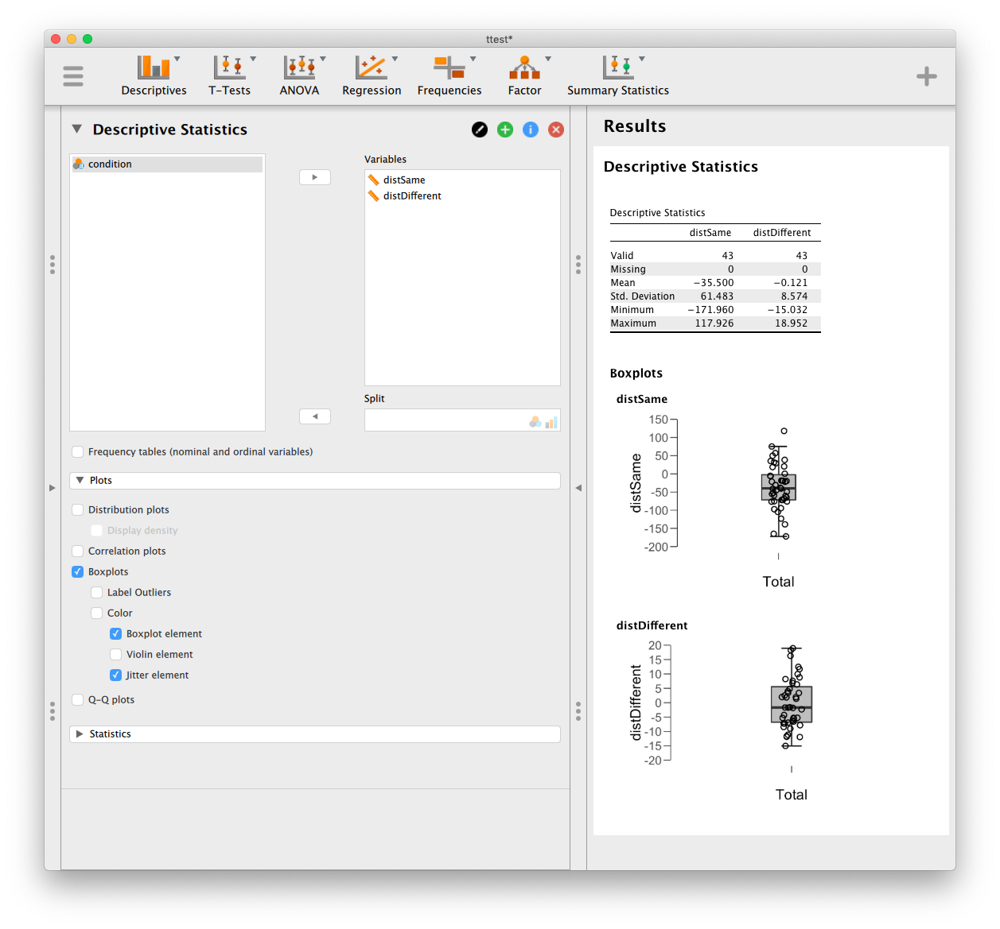

```{r start, include = FALSE}
library(papaja)
```

# Introduction to Bayesian hypothesis testing

<!-- To elaborate on the concept of (Bayesian) hypothesis testing,  -->

Even though the reader of this paper is probably familiar with hypothesis testing, we believe that it is nonetheless instructive to go over the basics. 

\subsection{Hypotheses}
Hypothesis testing can be viewed as validating general claims based on a small sample of the general population. For illustrative purposes, suppose that we are policy makers confronted with a new study programme, which claims to increase the mathematical abilities of sixth graders in the United States. To ease the exposition we use a (fictitious) scale called the Scale for Advancing Mathematical Ability (SAMA) to measure mathematical ability. As policy makers we know that the population mean SAMA score is \( \mu_{0}=50 \) and that the standard deviation is \( \sigma=10 \) for the population of sixth graders that are taught using the standard materials in the US. 

The superiority claim about the new study programme can be formalised as the working hypothesis \( \mathcal{H}_{1} : \mu > 50 \). Here \( \mu \) refers to the \emph{population} mean of SAMA score of the same sixth graders, but taught using the new study programme instead. Such a treatment population does not (yet) exist and \( \mu \) cannot be measured, and is, therefore, unknown. 

To nonetheless infer the validity of the working hypothesis \( \mathcal{H}_{1} \), we run an experiment in which \( n=90 \) sixth graders are taught with the new study programme. Suppose that these particular participants scored an average SAMA score of \( \bar{x} = 52.07 \). Clearly, this sample mean is larger than the status quo population mean of \( 50 \), but can we assume that this finding generalises to the whole population? If the answer is "yes" and we declare the working hypothesis to be verified, then how confident would we be about such a decision? Below we recall how \( p \)-values are typically used to make hard "yes" and "no" decisions, and we remind the reader why a \( p \)-value does not quantify the (un)certainty of such decisions.


\subsection{Statistical models}
To deduce how hypotheses, claims about the population such as \( \mu \), affect the data, such as \( \bar{x} \), we have to link the former to the latter with a distribution, for instance, with a normal distribution. The population parameters, the distribution that links them to the data, and the data together make up a (statistical) model, which allows for quantitative predictions. For instance, the claim that the treatment population is identitical to the current population of sixth graders implies the null model \( \mathcal{M}_{0} \) comprised of (1) the null hypothesis \( \mathcal{H}_{0}: \mu = 50 \), (2) the assumption \( \sigma = 10 \), and (3) normally distributed SAMA scores. When all three assumptions hold true, we then deduce that the \emph{potential} average SAMA score consisting of a group of \( n = 90 \) participants is expected to fall within the interval \( 47.93 = 50 - 1.96 \frac{10}{\sqrt{n}} \) and \( 52.07 = 50 + 1.96 \frac{10}{\sqrt{n}} \) with 95% chance. <!-- 
-->
\footnote{We use ``chance'' to refer to probabilistic statements about the data.}
<!-- 
-->

\subsection{Null hypothesis significance testing}
Reasoning from the general population under the assumption that the parameters are known to derive statements about potential outcomes forms the basis of null hypothesis signficance testing. By definition the \( p \)-value is the chance of seeing the observed outcome and more extreme --but \emph{unobserved}-- outcomes under the null. 

Under the null model \( \mathcal{M}_{0} \), the more extreme data are potential outcomes of \( \bar{x} \) larger than the observed sample mean of \( 52.07 \), but also lower than the unobserved possible sample mean of \( 47.93 = 50 - (52.07-50) \). Under the null, and the normality assumptions in particular, allows us to deduce that the chance of seeing a potential \( \bar{x} \) in \( (- \infty, 47.93] \) or \( [52.07, \infty) \) is 5%, thus, \( p=0.05 \). Note that \( 1 - p = 0.95 \), which is the 95% chance of the non-extreme event of having \( \bar{x} \) fall within the interval \( [47.93, 52.07] \), if the null model holds true. We use this example to emphasise that \( p \)-values help us reason from the null model to (potential) data, but they do not allow us to make quantitative statements from the actually observed data about the hypotheses. 

A low \( p \)-value has many causes, and for the case we mention four: (1) the null hypothesis is not true, (2) the true variance is actually higher than \( 10 \), (3) the data are not normally distributed, or (4) the null model actually holds true, but we saw a rare event. Despite the various causes of a low \( p \), typically only (1) is singled out and mentioned as \emph{the} culprit. The typical conclusion is then to reject the null, and the working hypothesis \( \mathcal{H}_{1} :  \mu > 50 \) is proposed as the winner. Note that this type of reasoning provides only an indirect argument for our working hypothesis, as the predictions of the working hypothesis itself were not considered at all. Only the null was used in the computation of \( p \). The fact that the null is not a good fit for the data, does not automatically imply that the alternative fit the data well. 

We conclude our summier review on \( p \)-values with three observations: (i) the comparison between \( \mathcal{H}_{0} \) and \( \mathcal{H}_{1} \) is unfair, (ii) \( p \)-values only allow us to deduce predictions from the general population to potential data, but not the other way around, and (iii) \( p \)-values can only lead to hard reject or non-reject decisions, which ignores the nuances of a scientific enquiry. 

<!--
the \( p \)-value does not provide us with a measure of uncertainty about the hypotheses, because they are chance statements about potential data, and not about the hypotheses. 

The latter implies that one can only come to the conclusion of accept or reject, without  -->

\subsection{Bayesian testing}
Bayesian testing addresses these problems as follows: Firstly, it compares the two hypotheses on equal footing by also  operationalises the alternative model. For the case at hand, \( \mathcal{M}_{1} \) would be comprised of the assumptions (1') \( \mathcal{H}_{1}: \mu > 50 \), (2) \( \sigma =10 \) as before, and (3) the data being normally distributed as before. By doing so, violation of normality and the assumed standard deviation will hit both models equally. Secondly, to reason from a particular observed outcome to the general population, it employs Bayes rule. To do so, we require to express our uncertainty about the two hypotheses in terms of so-called prior model probabilities before data observation. 

Prior model probabilities help us contextualise the testing problem. Working as policy makers, we might have seen many claims of improved study programmes that did not work out well. For instance, if 4-to-1 claims of improved study programmes led to null results, we might set \( P( \mathcal{M}_{1}) = 0.2 \) and \( P(\mathcal{M}_{0}) = 0.8 \). On the other hand, the designers of the new study programme to increase SAMA scores might choose \( P( \mathcal{M}_{1}) = 0.7 \) and \( P(\mathcal{M}_{0}) = 0.3 \) instead. If \( \mathcal{M}_{1} \) and \( \mathcal{M}_{0} \) are the only models under consideration we have \( 0 < P( \mathcal{M}_{0}) < 1 \) and \( P( \mathcal{M}_{1})= 1 - P( \mathcal{M}_{0}) \). The Bayes factor \( \textnormal{BF}_{10}(d) \) is a function of the observed data \( d \) that updates these prior model probabilities to posterior model probabilities, as follows:

\begin{align}
\label{eqPriorToPosterior}
P(\mathcal{M}_{1} \, | \, d) = \frac{ \textnormal{BF}_{10}(d) P(\mathcal{M}_{1})}{\textnormal{BF}_{10}(d) P(\mathcal{M}_{1}) + P(\mathcal{M}_{0})} \text{, and } P(\mathcal{M}_{0} \, | \, d) = 1 - P(\mathcal{M}_{1} \, | \, d). 
\end{align}

Note that the data only enter the formula via the Bayes factor. For instance, if \( \textnormal{BF}_{10}(d) = 6 \), then the sceptic's probability of the superiority of the new study programme increases to 60%, i.e., \( P(\mathcal{M}_{1} \, | \, d)=0.60 \), and retains 40% probability of for the null after data observation. On the other hand, the proponent of the new study programme would report a posterior model probability of \( P(\mathcal{M}_{1} \, | \, d)=0.93 \) and \( P(\mathcal{M}_{0} \, | \, d)=0.07 \). Note that the posterior model probabilities combine what we believed prior to data observation with the evidence of the data in terms of the Bayes factors. Both sceptic and the proponent could, if they wish, declare the new study programme to be superior to the status quo, but the sceptic would be much less confident than the proponent. The resulting posterior model probabilities can, thus, be used to complement a decision with a measure of uncertainty. 

**Bayes factor interpretations**
Prior model probabilities are context dependent, whereas Bayes factors only rely on the statistical design. To simplify notation we drop the reference to the data in the Bayes factor and denote them as \( \textnormal{BF}_{10} \), where the 1 in the subscript refers to the alternative model, and the 0 to the null model. Bayes factor ranges from zero to \( + \infty \), and \( \textnormal{BF}_{10} = 8 \) implies that the observed data are 8 times more likely under the alternative compared to the null model. The reciprocal of Bayes factors smaller than one are typically easier to interpret. For instance, \( \textnormal{BF}_{10} = 0.2 \) is easier interpret as \( \textnormal{BF}_{01} = 1/\textnormal{BF}_{10} = 5 \), which means that the observed data are 5 times more likely under the null compared to the alternative. Bayes factors are best viewed as a continuous measure of evidence. In general, \( \textnormal{BF}_{10} \) larger than one are perceived to provide evidence for the alternative against the null and if it grows to \( \infty \), the posterior model probability \( P(\mathcal{M}_{1} \, | \, d) \) grows to one, thus the more certain we will be about the adequacy of the alternative. 

Unlike the \( p \)-value, there are no universal standards for when a Bayes factor provides a sufficient amount of evidence. However, people have made recommendations in the past regarding sizes of Bayes factors, and these provide us with a helpful, but very rough guideline on its interpretation, when we do not know the context of the problem. In particular, we mention the recommendations of @jeffreys1961, who proposed the following scheme\footnote{We advise readers not to get too hung up on the specific labels and breakpoints in this table, see also @giollaInpresswhat.}:

\begin{tabular}{rl}
Bayes factor & Evidence\\
\hline
1-3 & anecdotal\\
3-10 & moderate\\
10-30 & strong\\
30-100 & very strong\\
\( > \)100 & extreme\\
\end{tabular}

In principle, the Bayes factor does not come with a specified decision rule. We believe that context made explicit using prior model probabilities by field experts are much more important, than overly generalised "rules" such \( p < 0.05 \) or \( \textnormal{BF} _{10} > k \), where \( k \) is some arbitrarily chosen number. 

# Tutorial examples
In this section, we describe a number of practical examples of using Bayesian inference in the context of numerical cognition. In the examples, each based on a well-cited paper in numerical cognition, we demonstrate a number of JASP's features using synthetic data sets, each generated in R using specific model assumptions that closely match the patterns of observed data described in the original papers.  The datasets, as well as the R script used to generate the datasets, are available for download from Github.

## Example 1: a Bayesian \( t \)-test

To demonstrate the Bayesian \( t \)-test, we will use a dataset based on @vergutsDeMoor2005, who investigated whether two-digit numbers are represented holistically on a mental number line, or instead are processed by decomposing into separate digit components. In their experiment, @vergutsDeMoor2005 presented subjects with pairs of two-digit numbers who had the same decade (e.g., 53 versus 51) or decades that differed by one (e.g., 53 versus 61).  Their reasoning for this manipulation was as follows: if subjects are using holistic processes to compare two-digit numbers, then they should exhibit a numerical distance effect [@moyer1967] on same-decade as well as different-decade pairs. That is, response times should be faster when the numerical distance between the two numbers is large, and slower when the numerical distance is small.  If, on the other hand, subjects are using decomposed processes, this numerical distance effect should disappear on the different-decade pairs. This is because in different-decade pairs, such as 53 versus 61, the comparison can be made solely on the basis of the decade digit alone. Thus, response times in this condition should be immune to manipulation of numerical distance. 

In their original paper, @vergutsDeMoor2005 found support for decomposed processing on the basis of several single sample \( t \)-tests. For subjects asked to choose the smaller of the digit pairs, they found (as expected) a statistically significant numerical distance effect for same-decade pairs, \( t(22) = -3.86 \), \( p<0.001 \). However, the distance effect was not significantly different from 0 for different-decade pairs, \( t(22)=-0.14 \), \( p=0.884 \). A similar pattern was found for subjects who were asked to choose the larger of each pair: there was a significant distance effect for same-decade pairs, \( t(19)=-5.31 \), \( p<0.001 \), but no significant distance effect for different-decade pairs, \( t(19)=0.70 \), \( p=0.479 \). 

### Theory of the Bayesian \( t \)-test

The Bayesian \( t \)-test forms the basis for the other tests described in this paper. The technical details are included for completeness, but are not necessary for the use of Bayes factors. 

Recall that a Bayes factor compares two models, say, \( \mathcal{M}_{1} \) and \( \mathcal{M}_{0} \), and suppose that the vector of free parameters of these models are denoted by \( \theta_{1} \) and \( \theta_{0} \) respectively. For instance, the \( \theta_{1} = ( \mu, \sigma) \) and \( \theta_{0} = \sigma \) for the one-sample \( t \)-test. 

To construct a Bayes factor, the statistician needs to select two priors --one for each model, which are denoted by \( \pi_{1} (\theta_{1}) \) and \( \pi_{0} (\theta_{0}) \) respectively (e.g., @bayarri2012criteria), and provide its users with a computational method. We only introduced the notation \( \pi_{1} (\theta_{1}) \) and \( \pi_{0} (\theta_{0}) \), chosen by the statistician, to highlight their difference to prior model probabilities which are denoted with a capital \( P \), chosen by the field experts. 

The Bayesian \( t \)-test is based on the priors \( \pi_{1} \), which puts a "uninformative" prior on the nuisance parameter \( \sigma \) (e.g., @ly2017tutorial) in conjunction with a Cauchy prior on the population effect size \( \delta = \mu / \sigma \), and the prior \( \pi_{0} \) with the same "uninformative" prior on the nuisance parameter \( \sigma \). With these priors, the resulting Bayes factor has a number of desirable properties: (1) The Bayes factor provides the same evidence independent on the units of measurements used for the data (e.g., @rouder2009bayesian). For instance, when the data consists of temperature measurements, the Bayes factor is the same whether the data were entered as Celsius, or Fahrenheit. (2) The Bayes factor is predictively matched, which means that it remains one, whenever the data set is not large enough. A Bayes factor of one implies that the posterior model probabilities equal the prior model probabilities, and nothing has been learned, see @jeffreys1961, for further details. (3) The Bayes factor is information consistent, which means that if for fixed sample size \( n \) the observed \( t \)-value goes to infinity, that the Bayes factor also goes to infinity, see @gronauInpressinformed, @ly2016harold for further details. (4) The Bayes factor is consistent, in the sense that as the data generated from the null model increases, thus, \( n \) grows, the Bayes factor \( \textnormal{BF}_{10} \) tends to zero. On the other hand, if \( n \) grows with data generated under the alternative, the Bayes factor \( \textnormal{BF}_{10} \) grows unbounded, see for instance @liang2008mixtures. (5) With the uninformative prior on \( \sigma \), this Bayes factor allows for optional stopping, that is, early stopping when there is enough evidence for the alternative (e.g., @hendriksen2018optional). On top of it also allows for optional continuation, which implies that one can build on top of previous results, see for instance @faulkenberry2019estimating, @grunwald2019safe, @ly2017replication.

With these priors at hand, the Bayes factor is defined as a ratio of marginal likelihoods, that is, 

\begin{align}
\textnormal{BF}_{10} = \frac{ \int_{\Theta_{1}} f(d \, | \, \theta_{1}) \pi_{1}(\theta_{1}) \textnormal{d} \theta_{1}}{\int_{\Theta_{0}} f(d \, | \, \theta_{0}) \pi_{0}(\theta_{0}) \textnormal{d} \theta_{0}}.
\end{align}

These technical details do not matter for most users, as the computations are done by JASP in the background. 

### Implementation in JASP

We will now describe a Bayesian analysis inspired by the original methods of @vergutsDeMoor2005. After downloading the file \texttt{ttest.csv} from the Github repository, you can open the file in JASP by clicking the menu button -- "Open" -- "Computer", which will then open a file browser for you to locate the downloaded file on your computer. Once the file is opened, you will be able to see a dataset with three variables (see Figure \@ref(fig:ttestData). The variable \texttt{condition} defines whether a participant was instructed to choose the smaller or the larger of each presented two-digit number pair. The variable \texttt{distSame} represents each subject's slope after regressing response times against numerical distance [c.f., @lorch1990] for same-decade pairs. Note that a negative slope is indicative of the numerical distance effect, as response times decrease as a function of increasing numerical distance. Finally, \texttt{distDifferent} represents each subject's regression slope for different-decade pairs.

{width=65%}

Similar to @vergutsDeMoor2005, we are interested in whether the mean of the regression slopes (collapsed across participants by condition) depends on the type of decade pair being compared. As a first step, we can easily obtain some descriptive statistics. In JASP, click on the "Descriptives" button in the top menu bar, then click "Descriptive Statistics" in the dropdown menu. This will open a dialogue box showing the list of variables available in our dataset. Highlight \texttt{distSame} and \texttt{distDifferent}, then click the right-facing arrow to move these into the "Variables" box. Immediately, some descriptive statistics will appear on the right side of the screen under "Results". To view the descriptives separately for the "Choose smaller" and "Choose larger" groups, we can move the variable \texttt{condition} into the "Split" box (see Figure \@ref(fig:ttestDescriptives)).

{width=90%}

We are now ready to perform a Bayesian analysis of the simulated @vergutsDeMoor2005 data. First, since we will separately analyze the "Choose smaller" and "Choose larger" groups, we will need to apply a *filter* to the dataset; specifically, we will first consider only the "Choose smaller" group. <!--@Tom, Would it be easier if we explained this using the click filter -->This is done in JASP by clicking on the filter icon (a small, funnel-shaped icon in the top left corner of the data sheet). After clicking on the funnel, a graphical drag-and-drop interface will appear at the top of the window. Since we are filtering on the variable \texttt{condition}, simply click the variable name on the left side of the filter dialogue.  This will make the variable name appear in the dialogue. Then, we click on the "=" symbol at the top of the dialogue. After this, type the name of the level we wish to retain; that is, we type \texttt{smaller} (without quotes). Finally, click the button at the bottom of the dialogue that says "Apply pass-through filter". When successful, the words will change to "Filter applied", and the bottom of the JASP window will update to tell us how many of the data rows passed through the filter (in this case, 23 will pass). You will also see that any row where \texttt{condition} is equal to "larger" will be grayed out.

To perform a Bayesian one-sample \( t \)-test, click on the "T-Tests" button in the ribbon and select "Bayesian One Sample T-Test". There are two \( t \)-tests that we will wish to perform, but for clarity, we'll start with describing one in detail. Before beginning, however, we will define our two competing hypotheses explicitly. Since the numerical distance effect is expected to be negative, we will define \( \mathcal{H}_{0}:\delta = 0 \) and \( \mathcal{H}_{-}:\delta < 0 \), where the minus refers to the working hypothesis of interest. 

We will first perform a \( t \)-test for the same-decade trials. From the variable list, move "distSame" over to the "Variables" box. Also, our alternative hypothesis defined so that the effect is negative, so we will choose "\( < \) Test value" from the "Alt. Hypothesis" menu. Finally, select also "Prior and posterior" from the "Plots" menu. This setup and the resulting output appears in Figure \@ref(fig:ttestBayes).  There are two components of this output that we will now discuss in detail: the computed Bayes factor (top of the Results pane in Figure \@ref(fig:ttestBayes)) and the plot of the prior and posterior for the effect size parameter \( \delta \) (bottom of the Results pane in Figure \@ref(fig:ttestBayes)). 

{width=90%}


The Bayes factor is \( BF_{-0}=9.027 \), which indicates that the observed data are approximately 9 times more likely under the alternative hypothesis \( \mathcal{H}_{1} \) than under the null hypothesis \( \mathcal{H}_{0} \). According to the convention of Jeffreys (1961), this is considered "moderate" evidence for \( \mathcal{H}_{1} \), which states that the true population effect \( \delta \) (from which our participants' regression slopes are drawn) is negative. A useful visual display of this Bayes factor is provided in the plot in the bottom of the Results pane. This probability wheel (or "pizza plot") depicts the Bayes factor as an odds ratio of 9:027-to-1 in favor of \( \mathcal{H}_{1} \).

The bottom plot shows this in more detail. The dashed line depicts the prior distribution for \( \delta \), which by default is set to be a Cauchy distribution with scale \(r=1/\sqrt{2} = 0.707 \) restricted to the negative line. <!-- @ I'm-->The solid line depicts the posterior distribution for \( \delta \). Under the assumption that the effect is negative, this distribution provides a measure of uncertainty about the size of \( \delta \) *after* observing the data. We can see in Figure \@ref(fig:ttestBayes) that the more probable values of \( \delta \) are now centered around \( \delta = -0.5 \). One specific value worth exploring is \( \delta=0 \). Notice that relative to the prior, the \( y \)-coordinate at \( \delta=0 \) in the posterior is smaller than the \( y \)-coordinate at \( \delta=0 \) in the prior distribution. This reflects the fact that our posterior belief that \( \delta=0 \) (i.e., \( \mathcal{H}_0)\) has decreased after observing the data. In fact, it has decreased by a factor of approximately 9, which is the Bayes factor we obtained. This relationship is no accident; For the \( t \)-test the Bayes factor for the null over the alternative will always be equal to the ratio of the heights of the \( y \)-coordinates associated with \( \delta=0 \) under the prior and posterior, respectively, a fact known as the Savage-Dickey density ratio [@wagenmakers2010]. 
In Figure \@ref(fig:ttestBayes) we are also provided information about the magnitude of \( \delta \) in the form of a 95% credible interval of [-0.962, -0.110]. This means that 95% of the posterior distribution is between these two values, so we can say that, with 95% probability, the true population value for the effect size \( \delta \) is between -0.962 and -0.110, if it is assumed to be negative. Note that while it is tempting to use this estimation as a replacement for the inference that is afforded by the Bayes factor, this approach is simply not valid. The credible interval presented here is *conditional on \( \mathcal{H}_{-} \)*, so it only makes sense *if* \( \mathcal{H}_{-} \) is the true model. Before interpreting the credible interval, we must perform a test to index support for \( \mathcal{H}_{-} \) over \( \mathcal{H}_{0} \). So, when reporting the credible interval, we should report the Bayes factor *first*, then we can report the credible interval. Do not be tempted to report the credible interval without the Bayes factor!

One last question to consider in our analysis is how sensitive the Bayes factor is to changes in the specification of the Cauchy prior on \( \delta \). Clicking the box for "Bayes factor robustness check" will help us to answer this question. Figure \@ref(fig:ttestRobust) displays the result of this robustness check. As mentioned before, the default prior for \( \delta \) is a Cauchy distribution with scale (or "width") \( r=0.707\). Figure 4 depicts how the Bayes factor changes with varying values of \( r \). Though the plot represents the Bayes factor as a continuous function of \( r \), JASP lists the Bayes factor at four values: the value of \( r \) that produces the maximum Bayes factor, the original user-specified prior (\( r=0.707 \)), a "wide" prior (\( r=1 \)), and an "ultrawide" prior (\( r=\sqrt{2}=1.414 \)). This plot should be interpreted holistically - across a wide range of values for the prior scale \( r \), the resulting Bayes factor ranges from 6.3 to 9, all indicating moderate evidence for \( \mathcal{H}_{1} \). 

{width=60%}

Now we are ready to perform a Bayesian \( t \)-test for the different-decade trials. Recall that these were the critical trials for @vergutsDeMoor2005, as a null numerical distance effect would lend support for a strictly decomposed model of two-digit number processing. We perform this test in an identical manner to the previous test, with one exception. After moving the variable \texttt{distDifferent} to the "Variables" list, we will select \( \textnormal{BF}_{01} \) from the "Bayes Factor" menu. Note that this is not strictly necessary to perform the analysis, but doing so will cast our Bayes factor in terms of support for \( \mathcal{H}_{0} \) over \( \mathcal{H}_{-} \). The result is shown in Figure \@ref(fig:ttestBayes2). We obtain \( \textnormal{BF}_{0-}=7.595 \), indicating that our data are approximately 7.5 times more likely under \( \mathcal{H}_{0} \) than \( \mathcal{H}_{-} \). This is moderate evidence that the true population effect \( \delta \), from which our data is drawn, is equal to 0. As we can see in the distribution plot of Figure \@ref(fig:ttestBayes2), our posterior belief that \( \delta=0 \) has *increased* relative to our prior belief that \( \delta=0 \), specifically by a factor of 7.595.

{width=90%}

It is again important to note that the 95% credible interval that is displayed in the distribution plot is conditional on \( \mathcal{H}_{-} \). In other words, it only makes sense if \( \mathcal{H}_{-} \) is the true model. However, in this case, we have moderate evidence that \( \mathcal{H}_{0} \) is the true model, so we can ignore this credible interval. After all, what sense is there in having a range of probable values for \( \delta \) if our most preferred model is the one in which the value of \( \delta \) is specified to be 0? It is also worth mentioning that there might be some confusion present when taking this credible interval at face value. Some might argue that since the credible interval does not contain 0 (its right endpoint is -0.004), this is actually evidence for \( \mathcal{H}_{-} \).  However, this is simply not true. The apparent paradox lies in how the credible interval is computed; in JASP the 95% credible interval is computed as the *central* 95% of the mass of the posterior distribution. Since there is no posterior mass to the right of \( \delta=0 \), this central portion of the posterior must necessarily be contained strictly to the left of \( \delta=0 \), thus producing the right endpoint that is slightly less than \( \delta=0 \). However, if we were to instead specify the credible interval as 95% of the posterior distribution with *highest density*, the resulting credible interval would contain \( \delta=0 \).  Currently, this functionality is not available in JASP, so great care must be taken in interpreting the credible interval for \( \delta \). 

We can follow the same steps described above on the participants who were assigned to the "choose larger" condition. The inference is largely the same. For same decade trials, we obtain \( \textnormal{BF}_{-0}=7.543 \), indicating that the data are approximately 7.5 times more likely under \( \mathcal{H}_{1} \) than under \( \mathcal{H}_{0} \). This provides moderate evidence that the true population effect \( \delta \) is negative, which is indicative of a negative numerical distance effect. For different decade trials, the inference is less clear; we obtain \( \textnormal{BF}_{0-}=1.893 \), indicating that the observed data are approximately 2 times more likely under \( \mathcal{H}_{0} \) than under \( \mathcal{H}_{-} \). However, this is only anecdotal evidence for \( \mathcal{H}_{0} \); simply put, the data are not very evidential for \( \mathcal{H}_{0} \). This inconclusivity is made even more apparent in Figure \@ref(fig:ttestSequential), which was obtained by selecting the "Sequential analysis" option. This plot shows how the Bayes factor changes sequentially as each data point is added, starting from \( \textnormal{BF}_{0-}=1 \) (no preference for either model) at \( n=1 \) to the obtained Bayes factor of \( \textnormal{BF}_{01}=1.893 \) at \( n=20 \). As can be seen in Figure \@ref(fig:ttestSequential), the incoming data were better predicted by \( \mathcal{H}_{-} \) than \( \mathcal{H}_{0} \), with the Bayes factor "crossing over" to support for \( \mathcal{H}_{0} \) at the 20th participant. Certainly, this shows that we should be quite reserved about our conclusions at this point. In fact, if these were real data, we might prefer to continue sampling additional participants until the Bayes factor stabilizes. Here, the definition of "stable" is unclear, but good practice would be to sample until the Bayes factor reaches 10, either in support of \( \mathcal{H}_{0} \) or \( \mathcal{H}_{-} \). 

{width=60%}

## Example 2: a Bayesian linear regression

We use an example inspired by @hollowayAnsari2009, who examined how mathematical fluency was predicted by two types of numerical distance effects (symbolic and nonsymbolic).

### Theory of Bayesian linear regression

Explain how Bayesian linear regression works.  Probably focus on using uniform prior model probabilities; beta-binomial may be too difficult for inclusion in this paper.

### Implementation in JASP

TJF - need to do some work here!

## Example 3: a factorial analysis of variance

To demonstrate a Bayesian factorial analysis of variance, we use a dataset based on @campbellFugelsang2001, who investigated the effects of problem size and numerical surface form on response times in an addition verification task. In addition to the usual effects of problem size (small problems are solved faster than large problems) and problem format (digit problems are solved faster than word problems), they found an interaction between size and format, which they interpreted as support for an interactive model of mental arithmetic where factors that affect encoding processes (e.g., surface format) can directly impact calculation processes. 

### Theory of Bayesian analysis of variance

explain how Bayesian anova works (at least enough to understand the basic options that JASP provides)

### Implementation in JASP

The simulated data based on this experiment can be found in the \texttt{anova.csv} file on Github. Loading this file into JASP, we can see four variables: \texttt{subject}, which encodes the subject number (1-48); \texttt{size}, which encodes problem size as either "small" or "large"; \texttt{format}, which encodes problem format as either "digit" or "word" , and \texttt{rt}, which represents the mean response time (in milliseconds) of correct trials for the given combination of subject, size, and format. Note that for the Bayesian analysis of variance we are about to perform, we will need to specify that \texttt{subject} is a nominal variable; to do this, simply click on the measurement level icon to the left of the variable name (the ruler) and select "Nominal" from the pop up menu.

To perform a Bayesian analysis of variance, we click the button for the "ANOVA" module and select "Bayesian ANOVA" from the menu. Then, we move the \texttt{rt} variable to the "Dependent variable" box, the \texttt{size} and \texttt{format} variables to the "Fixed Factors" box. Note that since these simulated data are from a repeated measures design, we will also need to tell JASP that \texttt{subject} is a random factor; thus we simply move this variable to the "Random Factors" box. There are many other options we could select, but for now, let us choose "Effects" and "Descriptives". The result is shown in Figure \@ref(fig:anovaBayes).

{width=90%}

The output shown in Figure \@ref(fig:anovaBayes) will look similar to the linear regression example we did previously. Based on the fixed factors that are entered, JASP constructs a set of models to reflect the possible additive and interactive combinations between these factors. Since we entered two fixed factors (size and format), JASP builds 5 competing models (all containing a random factor of \texttt{subject}:

\begin{align*}
  \mathcal{M}_0: & \text{ rt} \sim . \text{ (null model)}\\
  \mathcal{M}_1: & \text{ rt} \sim \text{size} \text{ (main effect of problem size only)}\\
  \mathcal{M}_2: & \text{ rt} \sim \text{format} \text{ (main effect of format only)}\\
  \mathcal{M}_3: & \text{ rt} \sim \text{size}+\text{format} \text{ (additive model, no interaction)}\\
  \mathcal{M}_4: & \text{ rt} \sim \text{size}+\text{format}+\text{size*format} \text{ (interactive model)}\\
\end{align*}

These models are each displayed in the rows of the output in Figure \@ref(fig:anovaBayes) in decreasing order of model fit (i.e., the best fitting model is listed at the top). We can see immediately that the best fitting model is \( \mathcal{M}_3 \), the additive model without the interaction term. But, to understand why it is the best model and how it compares to the other 4 models, we need to discuss what each of the columns in the output table represent.  

The first column, \( P(M) \), lists the prior probabilities of the 5 models. By default, JASP assigns these models to have equal probability, *a priori*. Since there are 5 models, the prior probability of each model is \( 1/5 = 0.2 \). The second column, \( P(M\mid \text{data}) \), gives the posterior model probabilities. Like the prior model probabilities, these must add to 1, but now there has been some shift from prior model probability to posterior model probability. Here, after observing data, we can see that the additive model \( \mathcal{M}_3 \) and the interactive model \( \mathcal{M}_4 \) account for most of our posterior belief (with posterior probabilities 0.821 and 0.179, respectively). The remaining three models essentially have posterior probability 0. 

The Bayes factors are contained in the third and fourth columns. Each column gives a slightly different type of Bayes factor, however, and must be interpreted appropriately. The third column, \( \textnormal{BF}_{M} \), gives the factor by which the prior odds for a given model have been updated to produce the posterior odds for that model. For example, consider the additive model \( \mathcal{M}_3 \). The prior odds for \( \mathcal{M}_3 \), which is defined as the probability that \( \mathcal{M}_3 \) is the true model divided by the probability that \( \mathcal{M}_3 \) is *not* the true model, can be computed as \( 0.2/(1-0.2) = 0.2/0.8 = 0.25 \). By similar calculation, the posterior odds are equal to \( 0.821/(1-0.821) = 0.821/0.179 = 4.587 \). Thus, the updating factor from prior odds to posterior odds is calculated as \( 4.587/0.25 = 18.393 \). One of the useful properties of this column is that it tells the user quickly whether the odds for a particular model has *increased* or *decreased*. As we can see in Figure \@ref(fig:anovaBayes), the only model for which model odds have increased is the additive model \( \mathcal{M}_3 \). 

Finally, the fourth column, \( \textnormal{BF}_{10} \), lists the Bayes factor for a given model compared to the best fitting model (note that this is the default setting in JASP, but if desired, it can be changed by the user to instead display the Bayes factor compared to the null model). This is a very useful column for the specific model comparison that is motivated by this example, namely the comparison of the additive model \( \mathcal{M}_3 \) to the interactive model \( \mathcal{M}_4 \). In the results table, we see that the Bayes factor for the interactive model \( \mathcal{M}_4 \) compared to the additive model \( \mathcal{M}_3 \) is 0.217. Taking reciprocals, this tells us that the Bayes factor for the additive model over the interactive model is $1/0.217 = 4.61$. In other words, the observed data are approximately 5 times more likely under the additive model than under the interactive model, giving moderate support for an additive-only model of mental arithmetic. 

The second table in the JASP results output simply recasts the results of the top table into a form that may translate better to researchers who are trained to think about ANOVA models as testing "effects". If we think about the terms of the model as potential effects to test, we have three questions: do we include (1) a main effect of problem size; (2) a main effect of format; and (3) an interaction effect? This problem is cast in terms of *inclusion probabilities*; i.e., what is the probability of including this term, or effect, in the best fitting model?  Of course, the problem is Bayesian, so we have to think about how prior model probabilities are updated to posterior model probabilities after observing data. This information is summarized in three columns, described next.

The first column, $P(\text{incl})$, lists the prior probability of including a particular term in the model. We can see that the prior probability of including "size" as a term in the model is 0.6, but let's see why this is the case. Recall above that we listed 5 possible models; note also that 3 of the 5 models contained the variable "size".  Thus, the prior probability of including size in our model is 3/5 = 0.6. The other prior inclusion probabilities can be computed similarly.

The second column, $P(\text{incl}\mid\text{data})$, gives the posterior probabilities of including a particular term in the model, after observing data. As we can see, the posterior inclusion probabilities for the effects of both problem size and format are very large (JASP reports them as 1.000). On the other hand, the posterior probability of including the interaction term actually decreases to 0.179 after observing data.  The third column, \( \textnormal{BF}_{\text{incl}} \), quantifies this change as the factor by which the prior odds of including the term (i.e., \( P(\text{incl})/P(\text{not incl})) \)) have changed to posterior inclusion odds after observing data. For both effects of problem size and format, this Bayes factor is extremely large, giving us overwhelming evidence for the "effects" of problem size and format.  However, the prior odds for including an interaction term have decreased from \( 0.2/(1-0.2) = 0.2/0.8 = 0.25 \) to posterior odds of \( 0.179/(1-0.179) = 0.179/0.821 = 0.218 \), a factor of \( 0.218/0.25 = 0.870 \). 

TJF -- need to finish this section.

# Summary and recommendations for further reading

\newpage

# References

\setlength{\parindent}{-0.5in}
\setlength{\leftskip}{0.5in}
